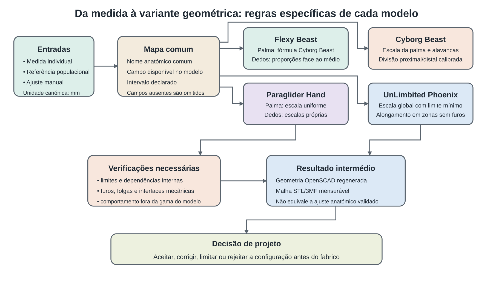

# Anexo C — Adaptação paramétrica dos modelos de mão protésica

## C.1 Objectivo e âmbito

Este anexo documenta como quatro modelos de mão protésica de origem aberta foram adaptados à estrutura paramétrica da plataforma HandFab: Flexy Beast, Cyborg Beast, Paraglider Hand e UnLimbited Phoenix Hand. O objectivo é tornar explícita a passagem entre medidas antropométricas, parâmetros configuráveis, relações geométricas e malhas destinadas à preparação para fabrico.

O anexo descreve o que está efectivamente implementado nos ficheiros de configuração e nos modelos OpenSCAD. Não apresenta as relações como regras anatómicas universais. Os intervalos declarados delimitam o espaço de configuração do protótipo e não constituem limites clínicos. Do mesmo modo, a geração de uma geometria coerente ou imprimível não demonstra ajuste individual, conforto, função, segurança ou eficácia protésica.

O estado examinado corresponde à versão 14.72.0 da plataforma em 14 de Julho de 2026. A versão 14.71.0 integrou a braçadeira revista do Flexy Beast e alterou o dicionário da versão 14.67.0: os antigos parâmetros de largura, comprimento e parede da braçadeira foram substituídos por circunferência do punho, inclinação, multiplicador de comprimento e furos de correia. A versão 14.72.0 uniformizou a organização dos grupos e os nomes dos controlos equivalentes, sem modificar as relações geométricas descritas neste anexo.

O modelo de desenvolvimento `pec Phoenix hand` não integra este anexo. Embora tenha sido desenvolvido no âmbito do projecto, não pertence ao conjunto de quatro modelos registados que sustenta a comparação principal da dissertação.

## C.2 Princípio comum de adaptação

Os modelos herdados não partilhavam nomes de parâmetros, mecanismos de escala ou formas equivalentes de preservar interfaces mecânicas. A adaptação não consistiu, portanto, em aplicar uma única fórmula a todas as mãos. Consistiu em criar uma gramática comum de entrada e, depois, manter uma transformação específica para cada arquitectura.

O percurso comum compreende cinco etapas:

1. uma medida individual, uma referência populacional ou um valor introduzido manualmente é expresso em milímetros;
2. o nome anatómico é associado a um campo canónico reconhecido pela plataforma;
3. o campo só é aplicado quando existe no modelo seleccionado e contém um valor numérico positivo;
4. o valor é limitado ao intervalo declarado na configuração quando provém do mapeamento de perfis;
5. o ficheiro OpenSCAD transforma os valores aceites segundo as relações próprias do modelo e gera a geometria.



Figura C.1 — Fluxo entre dados de entrada, mapa comum, regras específicas dos modelos e geometria exportável. Produção própria.

### C.2.1 Campos antropométricos comuns

O serviço `profileMapping.js` estabelece as correspondências apresentadas na Tabela C.1. A origem é a árvore normalizada `profile.measurements`; o vector `geometry_parameters` produzido pelo importador não é utilizado nesta passagem porque foi concebido para outra organização geométrica e não partilha os nomes dos modelos activos.

Tabela C.1 — Correspondência entre medidas normalizadas e parâmetros dos modelos

| Parâmetro da plataforma | Medida de origem | Aplicação |
| --- | --- | --- |
| `palm_breadth_mm` | `palm.width_mm` | Largura metacarpal usada na escala da palma ou da mão |
| `palm_length_mm` | `palm.length_mm` | Comprimento da palma; só tem efeito geométrico quando o modelo o utiliza |
| `palm_thickness_mm` | `palm.thickness_mm` | Espessura da palma; só tem efeito geométrico quando o modelo o utiliza |
| `index_finger_length_mm` | `digits.index.total_length_mm` | Comprimento total do indicador |
| `middle_finger_length_mm` | `digits.middle.total_length_mm` | Comprimento total do dedo médio |
| `ring_finger_length_mm` | `digits.ring.total_length_mm` | Comprimento total do anelar |
| `pinky_finger_length_mm` | `digits.pinky.total_length_mm` | Comprimento total do mindinho |
| `thumb_length_mm` | `digits.thumb.total_length_mm` | Comprimento total do polegar |
| `*_base_length_mm` | `digits.*.proximal_length_mm` | Comprimento do segmento proximal quando o modelo expõe esta divisão |
| `wrist_circumference_mm` | `wrist.circumference_mm` | Dimensionamento da braçadeira nos modelos que aceitam esta medida |

Uma medida em falta não é interpolada automaticamente: o campo é omitido e conserva o valor corrente ou fica disponível para introdução manual. Os valores válidos são arredondados a uma casa decimal. O mapeamento limita-os ao mínimo e máximo declarados no catálogo versionado dos modelos e regista as limitações aplicadas. Os parâmetros mecânicos, as cores, a visibilidade e a lateralidade não são preenchidos a partir das medidas corporais.

Quando a entrada é uma descrição livre, a plataforma pode seleccionar uma referência populacional através de uma pontuação baseada em sexo, categoria etária, proximidade da idade, país e qualidade descritiva do grupo. O perfil só é seleccionado quando a pontuação atinge três. Esta regra escolhe um ponto de partida; não mede proximidade anatómica entre populações e não substitui uma medida individual.

### C.2.2 Tipos de parâmetros

Para efeitos de projecto, os parâmetros foram organizados em quatro classes:

- **directos:** medidas ou decisões introduzidas no modelo, como largura metacarpal, comprimento de um dedo ou diâmetro de um pino;
- **derivados:** resultados calculados a partir de entradas, como factores de escala, proporções entre dedos ou deslocamentos de segmentos;
- **fixos:** constantes herdadas ou calibradas que preservam a geometria-base e as interfaces mecânicas;
- **contextuais:** campos presentes na plataforma, mas sem transformação geométrica activa no modelo em causa.

Esta separação é necessária porque o nome de um campo não garante, por si só, que a dimensão final da malha coincida numericamente com o valor introduzido. A transformação depende da geometria-base, da ordem das escalas e das restrições herdadas.

### C.2.3 Coerência dos controlos na versão 14.72.0

A versão 14.72.0 aplicou aos quatro modelos a mesma sequência de grupos quando estes existem: componente, antropometria, divisão de segmentos, componentes mecânicos, braçadeira, opções, visibilidade, cores e braço. Esta organização não acrescenta parâmetros nem demonstra melhoria de utilização; reduz diferenças de apresentação entre modelos e torna mais previsível a localização de decisões equivalentes.

Foram igualmente uniformizados dois nomes. O Phoenix passou de `LeftRight` para o campo booleano `mirrored`, já usado pelos restantes modelos. No Paraglider, `show_assembled` passou a `print_layout`, invertendo a formulação para coincidir com o controlo usado no Cyborg e no Phoenix: `true` corresponde à disposição plana destinada à exportação. Estas alterações incidem no contrato entre configuração e interface; não alteram a escala da palma, os comprimentos digitais ou as interfaces mecânicas.

## C.3 Flexy Beast

### C.3.1 Origem e estratégia de adaptação

O Flexy Beast deriva do trabalho de `daprice`, que combina o Parametric Cyborg Beast com o Flexy Hand. O ficheiro-fonte local indica licença CC BY-SA 4.0. O modelo usa uma palma da linhagem Cyborg Beast e segmentos digitais ligados por conectores flexíveis. A adaptação procurou separar três dimensões: escala da mão, comprimentos relativos dos dedos e braçadeira do antebraço.

### C.3.2 Entradas, limites e relações

Tabela C.2 — Parâmetros numéricos do Flexy Beast com efeito dimensional

| Família | Parâmetros e unidade | Valor inicial | Intervalo declarado | Relação implementada |
| --- | --- | ---: | --- | --- |
| Palma | `palm_breadth_mm` (mm) | 83 | 55–110 | `xScaleFactor = (palm_breadth_mm + 5) / 55`; os três eixos da mão usam o mesmo factor |
| Dedos | `middle_finger_length_mm` (mm) | 72 | 40–120 | `fingerLength = middle_finger_length_mm / (37 × xScaleFactor)` |
| Dedos | indicador e anelar (mm) | 68; 68 | 40–120 | proporção local = comprimento do dedo / comprimento do médio |
| Dedos | mindinho e polegar (mm) | 55; 65 | 30–100; 35–100 | proporção local = comprimento do dedo / comprimento do médio |
| Juntas | `joint_dia`; `joint_thick` (mm) | 7; 4 | 4–10; 1–6 | diâmetro do furo e espessura da ranhura do conector flexível |
| Braçadeira | `wrist_circumference_mm` (mm) | 160 | 110–260 | profundidade da braçadeira derivada de circunferência/π mais 6 mm |
| Braçadeira | `gauntlet_tilt` (graus) | 0 | −10–40 | rotação da braçadeira em torno do eixo do pino do punho |
| Braçadeira | `gauntlet_length_scale` (razão) | 0,7 | 0,7–1,5 | multiplicador do comprimento nativo reconstruído |
| Braçadeira | `gauntlet_rim_hole_d` (mm) | 2,5 | 1,5–6 | diâmetro dos furos de correia no rebordo |
| Punho | `wrist_pin_dia`; `wrist_pin_clearance` (mm) | 7; 0,35 | 4–10; 0,10–0,80 | furo da braçadeira = diâmetro do pino + 2 × folga |

O alcance de referência dos segmentos digitais é 37 mm à escala unitária, formado pelos valores nativos de 20 mm para a base e 17 mm para a ponta. O comprimento do dedo médio define o multiplicador mestre; os restantes dedos recebem uma proporção face ao médio. Esta transformação permite variar os comprimentos digitais sem obrigar a largura da palma a aumentar na mesma proporção.

Os conectores flexíveis são derivados das interfaces mecânicas: a parede em torno do furo é fixada em 1,2 mm; o raio do lóbulo é `joint_dia / 2 + 1,2`; a espessura da ponte corresponde a `joint_thick`; o comprimento ao longo do pino é `9,5 × xScaleFactor`; e a distância entre centros dos lóbulos é `8 × xScaleFactor`. Estes valores descrevem a geometria codificada e não resultam de um ensaio material nesta investigação. As juntas flexíveis não foram produzidas nos protótipos físicos.

### C.3.3 Braçadeira e interfaces confirmáveis

A versão actual reutiliza uma braçadeira reconstruída a partir da geometria de referência da braçadeira normal com tensionador. A forma orgânica principal está incorporada como malha poligonal reduzida; os furos mecânicos são novamente abertos de forma paramétrica. A largura nativa medida é 49,88 mm e os centros dos furos das abas situam-se em `X = ±22,6`, `Y = −58,3` e `Z = −9,8` mm no referencial da peça.

As relações principais são:

```text
g_hinge = (26,6 − 2,6) / 22,6
g_depth = (wrist_circumference_mm / π + 6) / (49,88 × xScaleFactor)
g_pin_bore = wrist_pin_dia + 2 × wrist_pin_clearance
```

O factor `g_depth` inclui a divisão por `xScaleFactor` porque a braçadeira volta a ser envolvida pela escala da mão na montagem. Desta forma, a profundidade impressa procura permanecer dependente da circunferência do punho e não da largura da palma. A posição é recalculada para fazer coincidir os furos das abas com o eixo do pino da palma, identificado no código por `Y = −27` e `Z = 5,5` mm.

O código confirma espessuras locais de 3,2 mm na zona dos furos médios e 5 mm nas zonas dos furos do pino e do rebordo. Não confirma uma espessura uniforme da casca orgânica nem uma tolerância de fabrico validada para toda a braçadeira. A folga de 0,35 mm é um valor configurável de projecto; não foi estabelecida por ensaio sistemático de montagem.

### C.3.4 Exemplo de propagação já preservado

O percurso numérico do perfil de ensaio de oito anos — valores aplicados, factores derivados e métricas de três malhas — encontra-se preservado no Suplemento 3 — Parametrização e percurso numérico. Para evitar duplicação, este anexo não repete a Tabela 4.10 nem os 42 registos do dicionário histórico. Acrescenta apenas a alteração posterior da braçadeira e os casos que expõem dependências ainda não descritas nesse suplemento.

O resultado central desse percurso continua a ser pertinente: `palm_breadth_mm` alimenta uma fórmula herdada e não define directamente a extensão transversal da malha. O caso documenta a propagação do valor; não demonstra correspondência anatómica.

### C.3.5 Limitações específicas

- a palma continua a usar escala uniforme;
- os comprimentos digitais controlam relações de alcance, mas não definem independentemente largura ou espessura dos dedos;
- a espessura integral da braçadeira não é um parâmetro no estado 14.72.0;
- os conectores flexíveis e a folga do punho carecem de ensaios materiais e de montagem;
- a configuração não contém afirmações `assert()` suficientes para impedir todas as combinações inválidas quando os valores são introduzidos fora da interface.

## C.4 Cyborg Beast

### C.4.1 Origem e estratégia de adaptação

O Cyborg Beast local preserva a palma e os segmentos digitais da linhagem MakerBlock/e-NABLE e acrescenta uma camada antropométrica, divisão proximal–distal, braçadeira dimensionada pelo punho, revestimento termoformável e disposição das peças para impressão. A licença não está explicitada no pacote local examinado; esta ausência documental deve permanecer indicada até ser confirmada na fonte original.

### C.4.2 Entradas e escala da mão

Os seis parâmetros principais de palma e dedos usam os mesmos valores iniciais e intervalos do Flexy Beast. A escala global é:

```text
overall_scale = (palm_breadth_mm + 5) / 55
```

Ao contrário do Flexy Beast, o comprimento de cada dedo é obtido através da inversão de curvas de alcance calibradas sobre a geometria original. A curva total usa 60,85 mm como alcance de referência local e duas inclinações: 1,584 para valores positivos da alavanca `len` e 1,328 para valores negativos. A alavanca é limitada ao intervalo interno de −22 a 50 para evitar extensões que o modelo classifica como inseguras para a geometria.

### C.4.3 Divisão proximal–distal

Os valores iniciais dos segmentos proximais são 22, 24, 22 e 16 mm para indicador, médio, anelar e mindinho; os intervalos são 12–60 mm nos três primeiros e 10–55 mm no mindinho. O polegar inicia em 27 mm, com intervalo 12–45 mm.

Para os quatro dedos, a transformação é:

```text
alcance_proximal_local(lp) = 23 + (2/3) × lp
lp = limitar((((base_mm / overall_scale) − 23) / (2/3)), −22, 50)
alcance_distal_de_referência = 60,85 − 23 = 37,85
ld = inversão da curva distal para preencher total_mm − base_mm
```

O segmento distal preenche o comprimento que resta depois do proximal, usando a inclinação correspondente ao sinal da alavanca. O posicionamento da ponta é igualmente deslocado para manter o eixo PIP coincidente.

No polegar, a relação foi ajustada por renderização sobre uma grelha de valores:

```text
alcance_local = 55,84 + 0,6185 × lp + 0,77 × ld
deslocamento da junção = −(23,667 + lp/3 + ld/3)
```

O código declara um resíduo máximo de 0,74 mm para este ajuste. Trata-se de uma calibração geométrica da implementação, não de um modelo anatómico do polegar.

### C.4.4 Braçadeira, folgas e parâmetros fixos

A braçadeira partilha a lógica descrita para o Flexy Beast. Recebe `wrist_circumference_mm` entre 110 e 260 mm, inclinação entre −10° e 40°, multiplicador de comprimento entre 0,7 e 1,5, diâmetro de pino entre 4 e 10 mm, folga entre 0,10 e 0,80 mm e furos de correia entre 1,5 e 6 mm. O furo resultante usa `wrist_pin_dia + 2 × wrist_pin_clearance`.

As constantes de referência da palma incluem raio de nó de 4,85 mm, altura do punho de 10 mm, altura da palma de 20 mm, largura-base de 64 unidades e espessura `th = 3`. Estes valores são herdados ou calibrados no modelo e não estão expostos como medidas antropométricas.

### C.4.5 Exemplo de propagação

Com largura da palma de 83 mm, comprimento do dedo médio de 72 mm e segmento proximal de 24 mm:

```text
overall_scale = (83 + 5) / 55 = 1,6
lp = ((24 / 1,6) − 23) / (2/3) = −12
alcance proximal impresso = 1,6 × [23 + (2/3) × (−12)] = 24 mm
ld ≈ −11,86996
alcance distal impresso = 48 mm
comprimento total calculado = 24 + 48 = 72 mm
```

O exemplo confirma a coerência interna das equações para esta configuração. A correspondência entre o alcance calculado e uma medição corporal teria de ser verificada num protocolo dimensional próprio.

### C.4.6 Limitações específicas

- as curvas dos dedos foram calibradas sobre a geometria original e não sobre uma amostra de mãos;
- o limite interno das alavancas pode impedir que combinações extremas atinjam exactamente o comprimento pedido;
- a calibração do polegar apresenta erro residual declarado;
- o revestimento termoformável é uma possibilidade construtiva, não uma interface corporal avaliada;
- o Cyborg Beast não integrou a comparação dimensional, os projectos de preparação ou as séries físicas descritas no estudo principal.

## C.5 Paraglider Hand

### C.5.1 Origem e estratégia de adaptação

O Paraglider Hand, também identificado como Flexible Flyer, deriva do trabalho de Marcus Mendenhall e encontra-se localmente associado à licença CC BY-SA 4.0. O conjunto integra ainda dependências das linhagens Reborn Hand e UnLimbited Arm com licenças próprias. A adaptação teve de conciliar duas exigências: permitir variação digital por dedo e manter a palma sob escala uniforme para não deformar os furos dos pinos.

### C.5.2 Relações implementadas

Tabela C.3 — Relações dimensionais do Paraglider Hand

| Entrada | Inicial; intervalo | Transformação ou estado |
| --- | --- | --- |
| `palm_breadth_mm` | 83; 55–110 mm | `overall_scale = palm_breadth_mm / 66,4` |
| `palm_length_mm` | 95; 60–140 mm | campo contextual; não deforma a palma de modo independente |
| `palm_thickness_mm` | 32; 18–50 mm | campo contextual; não deforma a palma de modo independente |
| `middle_finger_length_mm` | 72; 40–120 mm | `global_scale = valor / 57,6` |
| indicador e anelar | 68; 40–120 mm | escala própria = valor / 57,6 |
| mindinho | 55; 30–100 mm | escala própria = valor / 57,6 |
| `thumb_length_mm` | 65; 35–100 mm | campo disponível, mas o polegar usa actualmente `global_scale` |
| `string_channel_scale` | 0,9; 0,5–1,0 | razão aplicada ao canal de tracção |
| `elastic_channel_scale` | 0,9; 0,5–1,5 | razão aplicada ao canal de retorno |

A palma Reborn continha internamente `overall_scale = 1,25`. Como o módulo é carregado por `use`, esse valor permanecia no âmbito do ficheiro de origem e ignorava a escala calculada no modelo principal. A correcção foi aplicada no ponto de chamada:

```text
scale(overall_scale / 1,25) × scaled_palm()
```

O módulo continua a aplicar internamente 1,25; o efeito líquido passa a ser `palm_breadth_mm / 66,4`. A variante UnLimbited V3 não exigiu a mesma correcção porque é carregada por `include` e recebe a escala do ficheiro principal.

Os dedos indicador, anelar e mindinho recebem uma razão própria em relação a `global_scale`. O médio define a escala-base dos módulos `fingerator`. No estado examinado, o polegar também usa essa escala-base; `thumb_length_mm` é apresentado e pode ser preenchido pelo perfil, mas não controla autonomamente a geometria do polegar. Esta discrepância deve ser corrigida no modelo ou declarada no contrato de parâmetros.

### C.5.3 Hardware e limites confirmáveis

O selector `pin_index` escolhe entre quatro famílias de pino. Os diâmetros nominais usados no código são 3,1 mm para parafuso de 3 mm, 1,5875 mm para pino de 1/16", aproximadamente 2,413 mm para prego de calibre 13 e 1,5875 mm para pino de 1/16" sem chumaceira. O código define ainda folga nominal de 0,5 mm para a aba, profundidade de bolso de chumaceira de 0,4 mm e acréscimos locais de 0,25 ou 0,3 mm em algumas interfaces.

Estes valores são constantes ou opções de hardware. Não foram comparados com medições sistemáticas das peças impressas. A activação dos canais de cordão e de elástico acrescenta operações geométricas demoradas; a pré-visualização mantém esses canais desligados por omissão. Uma malha sem canais não representa, por isso, uma peça funcionalmente completa.

Os parâmetros `ARM_HandLen`, `ARM_ForearmLen`, `ARM_BicepCircum`, `ARM_CuffLength` e `ARM_PinHoleDia` pertencem à extensão opcional do braço. Não participaram na comparação da mão isolada e não devem ser apresentados como dados testados nos ensaios principais.

### C.5.4 Exemplo de propagação

Com largura da palma de 64 mm, dedo médio de 60 mm, indicador e anelar de 57 mm, mindinho de 46 mm e polegar declarado com 50 mm:

```text
overall_scale = 64 / 66,4 = 0,963855
correcção no ponto de chamada Reborn = 0,963855 / 1,25 = 0,771084
efeito líquido da palma = 1,25 × 0,771084 = 0,963855
global_scale do médio = 60 / 57,6 = 1,041667
escala do indicador = 57 / 57,6 = 0,989583
escala do anelar = 57 / 57,6 = 0,989583
escala do mindinho = 46 / 57,6 = 0,798611
escala actualmente aplicada ao polegar = 1,041667
```

O último valor mostra que os 50 mm declarados para o polegar não são propagados como escala própria. O exemplo deve ser tratado como diagnóstico de uma limitação, não como prova de correspondência individual.

### C.5.5 Limitações específicas

- a palma é escalada uniformemente por decisão mecânica;
- comprimento e espessura da palma são contextuais;
- o parâmetro de comprimento do polegar não tem transformação geométrica independente;
- a geometria completa dos canais pode exigir tempos de cálculo superiores e deve ser activada na exportação funcional;
- a extensão de braço contém parâmetros fora do âmbito dos ensaios da mão;
- as malhas avaliadas revelaram corpos abertos ou faces degeneradas em algumas peças, pelo que a aceitação pelo programa de preparação não equivale a sólido geometricamente válido.

## C.6 UnLimbited Phoenix Hand

### C.6.1 Origem e estratégia de adaptação

O UnLimbited Phoenix Hand local deriva da equipa UnLimbited/e-NABLE e indica licença CC BY-NC-SA 4.0 no ficheiro-fonte. A geometria herdada é composta sobretudo por malhas e poliedros de dimensão fixa. A adaptação preservou essas zonas e acrescentou duas formas de variação: uma escala uniforme para o conjunto e um alongamento localizado dos segmentos digitais em faixas sem furos.

### C.6.2 Escala global e limite dimensional mínimo

A largura de referência da palma é 82 mm. A percentagem de escala é:

```text
se HandPerc_override > 0:
    HandPerc = limitar(HandPerc_override, 100, 160)
caso contrário:
    HandPerc = limitar((palm_breadth_mm / 82) × 100, 100, 160)
```

`palm_breadth_mm` é declarado entre 82 e 131 mm. O parâmetro manual `HandPerc_override` aceita zero como instrução para derivar a escala; valores positivos ficam sujeitos ao mesmo limite mínimo de 100% e ao limite máximo de 160%. Um perfil com palma inferior a 82 mm produz o tamanho mínimo do modelo, não a medida pedida. A configuração deve ser rejeitada ou acompanhada por um aviso de cobertura, em vez de ser descrita como adaptação individual.

### C.6.3 Comprimentos digitais e preservação dos furos

Os quatro dedos iniciam com 72 mm de comprimento total e 31 mm de segmento proximal. Os comprimentos totais variam entre 55 e 115 mm e os proximais entre 18 e 55 mm. O polegar também parte de 72 e 31 mm, com intervalos respectivos de 45–80 e 18–50 mm.

O modelo usa as referências locais de 31 mm para o proximal e 41 mm para o distal:

```text
bd = base_length_mm − 31
td = (finger_length_mm − base_length_mm) − 41
```

A função `stretch_shaft()` divide a malha em três zonas. A zona da dobradiça mantém-se fixa, uma faixa sem furos é alongada ou encurtada, e a extremidade oposta é deslocada pelo mesmo valor. No proximal, a faixa usada situa-se entre Y = 20 e Y = 42; no distal, entre Y = −48 e Y = −14. Assim, as zonas dos furos não recebem escala não uniforme e conservam a secção circular.

### C.6.4 Dependência entre comprimento digital e escala global

Depois do alongamento local, toda a montagem é envolvida por `scale(HandPerc/100)`. Consequentemente, os parâmetros digitais não correspondem necessariamente ao comprimento final impresso quando `HandPerc` é diferente de 100%. O resultado depende de duas operações sucessivas: alteração local do segmento e escala uniforme do conjunto.

Esta ordem é relevante para a interpretação dos nomes `*_finger_length_mm`. A documentação interna que descreve uma alteração de 1:1 só é confirmável à escala de 100%. Para outras larguras de palma, deve ser medida a malha resultante ou reformulada a transformação para compensar a escala global.

### C.6.5 Exemplo de propagação

Para um dedo médio de 100 mm, segmento proximal de 40 mm e palma de 82 mm:

```text
HandPerc = 100%
bd = 40 − 31 = 9 mm
td = (100 − 40) − 41 = 19 mm
comprimento local nominal = 72 + 9 + 19 = 100 mm
```

Se se mantiverem os mesmos valores digitais e a largura da palma passar a 100 mm:

```text
HandPerc = (100 / 82) × 100 = 121,951%
comprimento local nominal antes da escala = 100 mm
comprimento nominal após a escala global ≈ 121,951 mm
```

O segundo cálculo não substitui uma medição da caixa envolvente ou do trajecto MCP–ponta, mas demonstra que o valor digital é novamente afectado pela escala global.

### C.6.6 Componentes fixos e tolerâncias confirmáveis

Os pinos, o bloco tensor e os pinos do tensor foram reconstruídos a partir de medições do ficheiro STEP e permanecem como componentes fixos. Os ficheiros contêm raios e posições medidos para cada corpo, mas não existe um parâmetro global de folga nem um ensaio dimensional consolidado que permita declarar tolerâncias de montagem. A escala uniforme da montagem também afecta estes componentes.

A reconstrução mantém a circularidade dos furos durante o alongamento local dos dedos. Esta propriedade geométrica não demonstra que a folga final entre pino e furo seja adequada depois da impressão, do material e da escala escolhida.

### C.6.7 Limitações específicas

- a palma não desce abaixo do tamanho de referência de 82 mm;
- os comprimentos digitais são afectados pela escala global;
- as zonas dos furos são preservadas, mas a folga física não foi medida de forma sistemática;
- os componentes de hardware permanecem associados à arquitectura original e são escalados com o conjunto;
- algumas malhas originais apresentaram descontinuidades; a reparação ou aceitação pelo programa de preparação deve ser distinguida da validade geométrica do sólido.

## C.7 Síntese comparativa das estratégias

Tabela C.4 — Comparação das adaptações e excepções de escala

| Modelo | Escala da palma | Variação dos dedos | Interface preservada | Limitação principal |
| --- | --- | --- | --- | --- |
| Flexy Beast | uniforme, pela fórmula Cyborg Beast | proporções próprias face ao médio | furos e ranhuras dos conectores; eixo do punho | campo de largura da palma não coincide directamente com a extensão da malha |
| Cyborg Beast | uniforme, pela fórmula Cyborg Beast | curvas calibradas e divisão proximal–distal | eixos MCP/PIP; abas e pino da braçadeira | curvas internas e limites de alavanca não são relações anatómicas universais |
| Paraglider Hand | uniforme para preservar furos | escalas próprias para quatro dedos; polegar ainda dependente do médio | furos cilíndricos dos pinos | comprimento do polegar e dimensões independentes da palma não estão plenamente propagados |
| UnLimbited Phoenix | uniforme, 100%–160% | alongamento de faixas sem furos | zonas de dobradiça e furos | comprimentos digitais voltam a ser afectados pela escala global |

A crítica ao escalonamento uniforme continua válida quando este é usado como substituto de todas as diferenças antropométricas. Nos modelos estudados, porém, a escala uniforme foi mantida localmente sempre que a arquitectura herdada dependia de furos circulares, espaçamentos ou componentes montados como conjunto. A decisão de projecto não foi eliminar toda a escala uniforme, mas limitar o seu alcance e acrescentar parâmetros locais onde a geometria o permitia.

Esta solução produz níveis diferentes de adaptação. O Flexy Beast e o Cyborg Beast separam largura da mão, comprimentos digitais e braçadeira; o Paraglider separa a escala da palma de parte dos comprimentos digitais; o Phoenix preserva a escala global e introduz alongamentos localizados. Os quatro modelos não são, por isso, intercambiáveis nem oferecem o mesmo grau de configuração.

## C.8 Critérios de aceitação, limitação e rejeição

Uma configuração pode avançar para geração quando os campos necessários existem, os valores são numéricos positivos e permanecem dentro dos intervalos declarados. Deve ser marcada como limitada quando uma entrada é fixada no limite mínimo do modelo, quando um campo é apenas contextual ou quando a transformação não produz uma correspondência directa entre valor e dimensão final.

Devem impedir a passagem directa para fabrico, ou exigir revisão técnica, as seguintes situações:

- perfil fora da gama dimensional do modelo;
- comprimento proximal igual ou superior ao comprimento total do dedo;
- alteração que faça um valor interno atingir os limites de uma alavanca calibrada;
- ausência de componentes necessários à função, como juntas flexíveis ou canais de tracção;
- malha aberta, não estanque ou com faces degeneradas sem justificação construtiva;
- folga ou espessura sem confirmação para a combinação de material, impressora e orientação;
- valor que chega ao modelo fora do intervalo declarado por contornar a interface.

O estado actual não aplica todas estas condições como bloqueios automáticos dentro de cada ficheiro OpenSCAD. Algumas estão representadas por limites da interface, outras por funções `min`/`max`, e outras permanecem como critérios de revisão. A distinção deve ser mantida no texto da dissertação.

## C.9 Relação com o Suplemento 3

O Suplemento 3 — Parametrização e percurso numérico preserva um estado histórico útil: contém 42 parâmetros numéricos dos três modelos comparados e um percurso do perfil de ensaio até a três malhas do Flexy Beast. Deve, contudo, ser identificado como fotografia do estado usado nesses ensaios.

Depois desse estado, a estrutura paramétrica da braçadeira do Flexy Beast foi alterada. Por esse motivo, `gauntlet_width_mm`, `gauntlet_length_mm`, `gauntlet_wall_mm`, `gauntlet_pos_adjust` e `strap_splay_adjust` não descrevem o estado final examinado. Foram substituídos, no essencial, por `wrist_circumference_mm`, `gauntlet_tilt`, `gauntlet_length_scale`, `gauntlet_rim_hole_d` e uma colocação automática sobre o eixo do pino. O presente anexo acompanha esse estado histórico com esta nota de evolução.

## C.10 Limite de interpretação

As adaptações mostram como modelos abertos e heterogéneos podem ser reorganizados em torno de um conjunto comum de medidas e controlos. O contributo é projectual e técnico: explicita decisões, dependências, excepções e fragilidades que ficam ocultas quando uma prótese é tratada apenas como um ficheiro STL escalável.

Não se conclui que as geometrias sejam anatomicamente adequadas a uma pessoa, que os intervalos sejam clinicamente seguros ou que as folgas assegurem montagem e funcionamento. Essas conclusões exigem medidas individuais, calibração dimensional, ensaios de fabrico, avaliação funcional e participação de profissionais e utilizadores.

## C.11 Fontes técnicas consultadas

- relatório técnico de adaptação antropométrica da plataforma;
- catálogo versionado de configuração dos modelos;
- serviços de correspondência e importação de perfis antropométricos;
- implementações OpenSCAD activas das famílias Flexy Beast, Cyborg Beast,
  Paraglider Hand e UnLimbited Phoenix, incluindo as dependências de montagem;
- dicionário integral de parâmetros e percurso numérico do perfil de ensaio,
  conservados no Suplemento 3 — Parametrização e percurso numérico;
- Capítulo 4 do manuscrito consolidado;
- relatório integral de revisão académica.

## C.12 Verificações executadas

- comparação dos quatro modelos registados com os parâmetros do catálogo versionado;
- leitura das fórmulas e constantes nos ficheiros OpenSCAD activos;
- confronto entre o Suplemento 3 e o estado final examinado;
- confirmação do mapa entre medidas normalizadas e nomes dos parâmetros;
- recálculo independente dos exemplos numéricos apresentados nas secções C.3 a C.6;
- verificação dos valores inicial, mínimo, máximo e incremento declarados;
- pesquisa de parâmetros contextuais sem efeito geométrico confirmado;
- identificação das relações que permanecem sem calibração dimensional ou ensaio físico.
