# Projecto completo

Versão do documento: 0.4.0-audit.1

## Capítulo 1 — Introdução

### 1.1 Enquadramento geral, contexto e motivação

A perda de membros superiores tem impacto funcional, social e simbólico: limita tarefas quotidianas, altera formas de interação e afeta a perceção de identidade e autonomia. Por isso, uma prótese não pode ser avaliada apenas como solução mecânica. O seu valor depende da articulação entre desempenho, conforto, integração estética, aceitabilidade social, manutenção e custo.

A impressão 3D e os modelos *open source* ampliaram o acesso a dispositivos protésicos, sobretudo em contextos com recursos limitados. Contudo, muitos desses modelos continuam assentes em geometrias fixas, escalonamentos globais ou ajustes manuais pouco documentados. A consequência é uma personalização irregular: o dispositivo pode ser mais acessível, mas nem sempre é anatomicamente ajustado, reprodutível ou fácil de validar.

É neste ponto que o Design Industrial assume relevância. A investigação parte da hipótese de que a parametrização, articulada com dados antropométricos e com inteligência artificial usada como apoio à decisão, pode transformar modelos protésicos rígidos em sistemas configuráveis. O objetivo não é automatizar integralmente o projeto, mas estruturar um processo em que o designer, o técnico e o utilizador possam compreender, ajustar e validar alternativas de forma mais clara.

### 1.2 Problema de investigação

Apesar da democratização parcial da produção de próteses através do fabrico aditivo, persiste uma lacuna entre personalização anatómica, adequação funcional e metodologias centradas no utilizador. Os processos atuais revelam dependência de ajustes empíricos, dificuldade em acomodar perfis antropométricos diversos e falta de plataformas configuráveis que liguem dados corporais, regras geométricas e apoio algorítmico de forma rastreável.

O problema central desta investigação é compreender como o design de produto, através de sistemas paramétricos e inteligência artificial assistiva, pode apoiar a personalização de próteses de membros superiores de modo acessível, reprodutível e tecnicamente controlado.

### 1.3 Objetivos da investigação

### 1.3.1 Objetivo geral

O objetivo geral é gerar conhecimento através da prática do Design, desenvolvendo e avaliando um sistema paramétrico assistido por inteligência artificial para próteses personalizadas de membros superiores. O sistema articula Design Industrial, Design Inclusivo, antropometria aplicada e Design paro Fabrico Aditivo.

### 1.3.2 Objetivos específicos

Os objetivos específicos são:

1. Analisar criticamente o papel do Design Industrial na mediação entre tecnologia, corpo e experiência de uso em próteses de membro superior.

2. Identificar requisitos anatómicos, funcionais, ergonómicos, estéticos e produtivos relevantes para sistemas protésicos personalizados.

3. Estruturar um modelo paramétrico capaz de traduzir dados antropométricos em geometrias configuráveis e fabricáveis por impressão 3D.

4. Desenvolver uma plataforma digital que torne o modelo paramétrico operável por perfis de utilizador diferenciados.

5. Explorar a inteligência artificial como camada assistiva para sugestão, validação preliminar e interpretação de parâmetros, mantendo supervisão humana e rastreabilidade.

6. Avaliar a abordagem através de prototipagem, análise técnica e reflexão crítica sobre o processo de design.

### 1.4 Questões de investigação

A investigação organiza-se em torno das seguintes questões:

1. Como podem o design de produto, os métodos paramétricos e a inteligência artificial melhorar a personalização, o conforto e a adequação funcional de próteses de membro superior sem comprometer acessibilidade e controlo projetual?

2. Que metodologias e ferramentas permitem validar a usabilidade, a durabilidade, a fabricabilidade e a reprodutibilidade de próteses impressas em 3D?

3. De que modo o Design Industrial pode conciliar requisitos anatómicos, funcionais, ergonómicos, estéticos e simbólicos, promovendo aceitação, dignidade e autonomia?

### 1.5 Abordagem metodológica geral

O projeto adota uma metodologia aplicada, baseada em Research Through Design. O ato de projetar é tratado como forma de investigação: cada modelo, protótipo, configuração e iteração funciona simultaneamente como resultado técnico e como meio de produzir conhecimento sobre o problema.

A estrutura metodológica articula três fases. A fase conceptual consolida o enquadramento teórico, o estado da arte e os requisitos. A fase metodológica define a arquitetura do sistema paramétrico, a plataforma digital e a integração assistiva da IA. A fase empírica operacionaliza a modelação, a geração de variantes, a prototipagem por impressão 3D e a avaliação técnica, usando dados antropométricos públicos e não dados pessoais de utilizadores reais.

### 1.6 Estrutura da dissertação

A dissertação organiza-se em nove capítulos. O Capítulo 1 apresenta o enquadramento, o problema, os objetivos, as questões de investigação e a abordagem metodológica. O Capítulo 2 desenvolve o enquadramento teórico e o estado da arte. O Capítulo 3 explicita a metodologia. O Capítulo 4 descreve o desenvolvimento do modelo paramétrico. O Capítulo 5 aborda a plataforma web e a integração digital. O Capítulo 6 trata da integração da inteligência artificial. O Capítulo 7 discute a interface, a interação e a experiência de utilização. O Capítulo 8 reúne a estratégia de avaliação e a discussão dos resultados disponíveis. O Capítulo 9 sintetiza as conclusões, limitações e trabalhos futuros.

## Capítulo 2 — Enquadramento Teórico e Estado da Arte

### 2.1 Prótese de membro superior e dispositivos médicos

Prótese de membro superior é um dispositivo médico externo que substitui um segmento ausente devido à amputação ou a uma deficiência congénita. Vai além da restituição formal: recupera funções, facilita atividades diárias, melhora a autonomia e reduz o impacto psicossocial da perda ([Fink & Diamond, 2023](#ref-fink-2023); [Segura et al., 2024](#ref-segura-2024)).

A perda total ou parcial de um membro superior provoca consequências físicas, funcionais, sociais e emocionais profundas. "Perda total" refere-se à ausência completa do membro, enquanto "perda parcial" indica ausência apenas de parte dele. A mão humana incorpora capacidades motoras e sensoriais complexas, abrangendo o alcance (movimento do membro para tocar ou agarrar objetos), a preensão (ato de segurar objetos), a manipulação fina (habilidade para movimentos precisos), a estabilização (manter objetos ou posições), a coordenação bimanual (uso de ambas as mãos em colaboração) e a exploração tátil (deteção de propriedades dos objetos pelo contacto). Replicar artificialmente estas funções continua a ser um desafio significativo nos dispositivos médicos e na reabilitação. O desenvolvimento e a prescrição de próteses envolvem compromissos permanentes entre funcionalidade, peso, robustez, conforto, controlo intuitivo, manutenção e custo.

Nas últimas décadas, o setor evoluiu de soluções maioritariamente cosméticas e mecânicas para sistemas com maior sofisticação eletromecânica, integração eletrónica melhorada e maior potencial de personalização. Ainda assim, o avanço tecnológico não resolveu desafios estruturais como desconforto, dificuldade de controlo, ausência de feedback sensorial e elevada taxa de abandono. Esta tensão entre potencial técnico e resultados práticos é fundamental para compreender o estado atual das próteses de membro superior como dispositivos médicos.

#### Tipologias de próteses de membro superior

As próteses de membro superior podem ser classificadas de acordo com a fonte de energia e o mecanismo de controlo. Para efeitos desta dissertação, distinguem-se quatro categorias principais: passivas ou cosméticas, mecânicas acionadas pelo corpo, mioelétricas e híbridas. Cada tipo expressa um equilíbrio distinto entre desempenho funcional, conforto, durabilidade, manutenção e custo.

Próteses passivas destinam-se à aparência e ao apoio estático em tarefas simples, sem preensão ativa. Variam entre dispositivos rígidos e versões ajustáveis, nas quais os dedos ou os terminais podem ser movidos manualmente. São leves, simples, silenciosas e requerem pouca manutenção. Oferecem utilidade funcional limitada e são preferidas quando a estética é prioritária ou quando o utilizador procura um dispositivo discreto ([Fink & Diamond, 2023](#ref-fink-2023); [Segura et al., 2024](#ref-segura-2024)).

#### Próteses mecânicas acionadas pelo corpo (*body-powered*)
As próteses mecânicas utilizam sistemas de arnês e cabos para converter movimentos do ombro, do tronco ou da cintura escapular em ação no dispositivo terminal, tipicamente um gancho ou uma mão mecânica. São soluções tradicionalmente valorizadas pela robustez, fiabilidade, menor custo e relativa facilidade de manutenção. Um atributo particularmente relevante é o feedback [^1]proprioceptivo indireto proporcionado pela tensão transmitida pelo sistema de cabos, que pode contribuir para um controlo funcional mais previsível em determinadas tarefas. Contudo, estas próteses apresentam limitações expressivas: o arnês pode ser desconfortável e restritivo, os padrões de preensão tendem a ser mais limitados e a sua utilização exige esforço físico contínuo e aprendizagem motora específica ([Engdahl et al., 2024](#ref-engdahl-2024); [Fink & Diamond, 2023](#ref-fink-2023)).

#### Próteses mioelétricas
As próteses mioelétricas são dispositivos eletricamente alimentados que utilizam sinais eletromiográficos (EMG) captados através de elétrodos de superfície aplicados no membro residual. Esses sinais são processados eletronicamente e ativam os motores responsáveis pelo movimento da mão, do punho ou do cotovelo. Em comparação com as soluções mecânicas, apresentam habitualmente maior integração estética, ausência de arnês e potencial para padrões de movimento mais sofisticados. Em alguns casos, a sua utilização tem sido associada à redução da dor fantasma e a uma experiência de uso mais aceitável em contextos sociais. As suas limitações incluem maior peso, custo mais elevado, dependência de baterias, maior sensibilidade à humidade e a interferências, necessidade de calibração e ausência de feedback sensorial direto ([Bates et al., 2020](#ref-bates-2020); [Engdahl et al., 2024](#ref-engdahl-2024)).

#### Sistemas híbridos
Combinam mecanismos mecânicos e elétricos no mesmo dispositivo. São particularmente frequentes em amputações proximais, como amputações transumerais ou desarticulações do ombro, podendo associar, por exemplo, controlo mecânico do cotovelo e controlo mioelétrico do terminal. Esta configuração procura tirar partido das vantagens específicas de cada sistema, distribuindo o peso, as exigências funcionais e a complexidade de controlo. Em contrapartida, a aprendizagem, a adaptação e a manutenção podem tornar-se mais exigentes ([Segura et al., 2024](#ref-segura-2024); [Walters et al., 2025](#ref-walters-2025)).

Uma representação visual útil desta diversidade tipológica é apresentada na Figura 2.1, que reúne exemplos de próteses impressas em 3D com soluções morfológicas e mecânicas distintas, ajudando a perceber como diferentes opções de configuração materializam compromissos distintos entre simplicidade, função e custo.

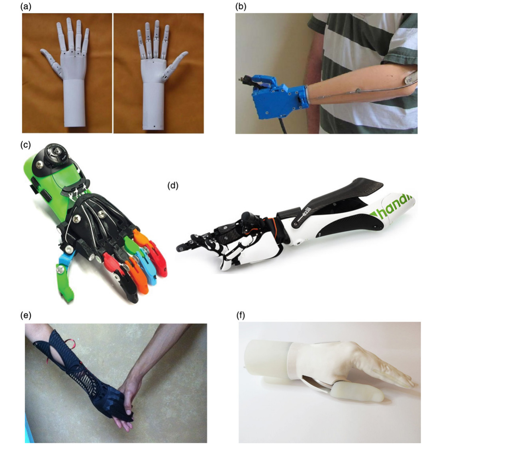

Figura 2.1 — Exemplos de próteses de membro superior impressas em 3D, ilustrando diversidade tipológica e construtiva.

Fonte original: ten Kate, J., Smit, G., & Breedveld, P. (2017). 3D-printed upper limb prostheses: A review. Disability and Rehabilitation: Assistive Technology, 12(3), 300-314. https://doi.org/10.1080/17483107.2016.1253117

#### Considerações clínicas e funcionais

A prescrição de uma prótese de membro superior constitui um processo clínico complexo, centrado no utilizador e conduzido por uma equipa multidisciplinar composta por médicos, protesistas, terapeutas e pelo próprio utilizador/paciente na escolha do dispositivo terminal, mas envolve uma avaliação integrada de fatores físicos, funcionais, ocupacionais e psicossociais ([Fink & Diamond, 2023](#ref-fink-2023); [Soyer et al., 2016](#ref-soyer-2016)).

Entre os fatores físicos incluem-se o nível de amputação, o comprimento e a condição do coto residual, a integridade cutânea, a amplitude articular e a força muscular. Amputações de nível mais proximal implicam desafios acrescidos em termos de controlo e do peso do sistema protésico.

Os fatores individuais, como idade, comorbilidades, dominância manual, literacia técnica, contexto profissional e atividades recreativas, influenciam significativamente a escolha da tipologia protésica. A título de exemplo, utilizadores envolvidos em trabalho manual intensivo ou em ambientes mais exigentes podem beneficiar de soluções mecânicas mais robustas, enquanto contextos profissionais e sociais em que a integração estética e a diversidade funcional são mais valorizadas podem favorecer dispositivos mioelétricos.

Os fatores psicossociais, incluindo motivação, expectativas, imagem corporal, suporte social e capacidade cognitiva, são igualmente determinantes. Expectativas irrealistas relativamente às capacidades do dispositivo podem levar à insatisfação, ao uso intermitente e ao eventual abandono.

A reabilitação protésica desenvolve-se em fases — cuidados perioperatórios, preparação pré-protésica, treino com prótese definitiva e acompanhamento a longo prazo. O treino funcional é particularmente relevante em sistemas mioelétricos, exigindo fortalecimento muscular específico, aprendizagem da geração de sinais consistentes e integração progressiva do dispositivo em tarefas reais. De modo recorrente, a literatura sublinha a importância do seguimento continuado, da educação do utilizador e do ajustamento iterativo do dispositivo ao longo do tempo ([Bates et al., 2020](#ref-bates-2020); [Soyer et al., 2016](#ref-soyer-2016)).

#### Medição de resultados e abandono protésico

A avaliação objetiva do sucesso protésico continua a ser um desafio. Persistem a escassez de instrumentos padronizados e a heterogeneidade de métricas, o que dificulta a comparação entre estudos, dispositivos e estratégias de reabilitação. São utilizadas ferramentas de avaliação registadas pelo utilizador, centradas na funcionalidade percebida, na satisfação e na qualidade de vida, bem como testes baseados em desempenho, orientados para a destreza, a velocidade de execução e o controlo funcional em tarefas estruturadas ([Segura et al., 2024](#ref-segura-2024); [Soyer et al., 2016](#ref-soyer-2016)).

Apesar da evolução tecnológica, as taxas de abandono permanecem elevadas. A literatura associa, de forma recorrente, a rejeição protésica a problemas de conforto, peso, funcionalidade insuficiente, manutenção exigente e controlo pouco intuitivo. Esta persistência indica que a melhoria tecnológica isolada não garante adoção sustentada. Ainda assim, quando o dispositivo está adequadamente prescrito, ajustado e acompanhado, a utilização continuada de prótese tende a associar-se a maior independência funcional e a melhores indicadores de participação e de qualidade de vida do que a não utilização ([Fink & Diamond, 2023](#ref-fink-2023); [Smail et al., 2020](#ref-smail-2020)).

Esta persistência do abandono é sintetizada de forma clara na Figura 2.2, que relaciona uso, rejeição primária e rejeição secundária, reforçando que o problema não é marginal, mas estrutural no campo das próteses de membro superior.

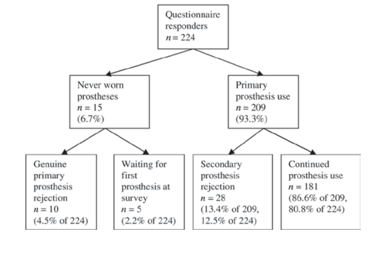

Figura 2.2 — Utilização, rejeição primária e rejeição secundária de próteses do membro superior adquiridas.

Fonte original (APA 7): Biddiss, E., Beaton, D., & Chau, T. (2007). Consumer design priorities for upper limb prosthetics. Disability and Rehabilitation: Assistive Technology, 2(6), 346-357. https://doi.org/10.1080/17483100701714733

#### Enquadramento regulatório enquanto dispositivo médico

As próteses de membro superior são classificadas como dispositivos médicos e estão sujeitas à regulamentação específica destinada a garantir a segurança, o desempenho e a vigilância ao longo de todo o ciclo de vida. Na União Europeia, o enquadramento é definido pela Regulamento ([^2]EU) 2017/745 (MDR) - https://eur-lex.europa.eu/eli/reg/2017/745/oj/eng*, que classifica os dispositivos nas Classes I, IIa, IIb e III. Dispositivos terapêuticos ativos, incluindo próteses mioelétricas, enquadram-se geralmente nas classes intermédias ou superiores, o que exige avaliação por um organismo notificado para efeitos de marcação CE[^3] ([Parlamento Europeu e Conselho da União Europeia, 2017](#ref-parlamento-europeu-2017)).

Nos Estados Unidos, a regulação é assegurada pela Food and Drug Administration (FDA) através de um sistema de classificação de risco. A maioria dos componentes protésicos convencionais enquadra-se nas classes de risco mais baixas, enquanto sistemas mais complexos, como próteses mioelétricas avançadas, podem exigir controlos , documentação técnica mais extensa e, em certos casos, evidência clínica adicional ([Resnik et al., 2010](#ref-resnik-2010)).

A demonstração de segurança e desempenho implica avaliação clínica sistemática, testes de biocompatibilidade, avaliação da segurança mecânica e elétrica, validação de software e consideração explícita de fatores humanos e de usabilidade. Normas desenvolvidas no âmbito do comité técnico ISO/TC 168[^4] contribuem para a padronização de requisitos aplicáveis a próteses e ortóteses. Adicionalmente, os fabricantes devem implementar sistemas de vigilância pós-comercialização, recolhendo dados de uso real ao longo do ciclo de vida do dispositivo, o que reforça a natureza regulada, iterativa e evidencial deste domínio ([Parlamento Europeu & Conselho da União Europeia, 2017](#ref-parlamento-europeu-2017); [Resnik et al., 2010](#ref-resnik-2010)).

### 2.2 Design Industrial, Design Inclusivo e Design Centrado no Utilizador

O design industrial, no contexto da saúde e das tecnologias de apoio, é reconhecido progressivamente como uma disciplina mediadora entre as necessidades humanas, os contextos de utilização e os sistemas técnicos regulados. A literatura evidencia que o design não se limita à configuração formal de produtos, mas também desempenha um papel estruturante na promoção da inclusão, da autonomia e da participação social, ao modelar a relação entre indivíduos e ambientes através de artefactos e sistemas. Em particular, nas tecnologias de apoio, o design é descrito como um elemento que medeia a interação entre os utilizadores e o seu meio envolvente, contribuindo para reduzir barreiras funcionais e sociais e, consequentemente, para melhorar os resultados de participação e a qualidade de vida ([Clarkson & Coleman, 2010](#ref-clarkson-2010); [Shah & Robinson, 2006](#ref-shah-2006)).

Paralelamente, o design inclusivo é apresentado como um imperativo contemporâneo que visa minimizar a exclusão evitável decorrente de decisões projetuais que não consideram a diversidade populacional e a variabilidade de capacidades ao longo do tempo. Esta perspetiva alinha-se com a responsabilidade dos sistemas de saúde de responder a utilizadores heterogéneos, com diferentes condições físicas, cognitivas e contextuais ([Clarkson & Coleman, 2010](#ref-clarkson-2010)).

### Design industrial em dispositivos médicos

No domínio dos dispositivos médicos, o design industrial surge tanto como prática metodológica centrada no utilizador como também com um papel colaborativo integrado em equipas multidisciplinares de desenvolvimento. A literatura identifica, contudo, uma lacuna estrutural: muitos dispositivos médicos continuam a ser desenvolvidos predominantemente com base em abordagens de engenharia e em requisitos regulatórios, com participação limitada de profissionais com formação específica em metodologias de design centrado no uso. Esta assimetria contribui para soluções tecnicamente robustas, mas nem sempre otimizadas em termos de ergonomia, usabilidade ou integração na vida quotidiana ([Fisher & Johansen, 2020](#ref-fisher-2020); [Wilke et al., 2020](#ref-wilke-2020)).

Neste contexto, o design industrial assume relevância não apenas na fase de conceptualização, mas também na definição de requisitos de utilização, na tradução de necessidades clínicas em soluções tangíveis e na articulação entre requisitos regulatórios e experiência do utilizador ([Fisher & Johansen, 2020](#ref-fisher-2020); [Shah & Robinson, 2006](#ref-shah-2006)).

Esta posição intermédia do design torna-se mais clara quando se observa a multiplicidade de papéis que os profissionais de saúde podem assumir nos processos de desenvolvimento. Em vez de contribuírem apenas como validadores de soluções, estes agentes podem ser intervenientes do seu setor, utilizadores peritos, mediadores entre domínios e profissionais clínicos ou investigadores, como sintetiza a Tabela 2.1.

Tabela 2.1 — Papéis dos profissionais de saúde no desenvolvimento de dispositivos médicos

| Intervenientes do setor                 | Identificam oportunidades, especificações e condicionantes regulatórias | Mercado, estratégia e processos de certificação            |
| --------------------------------------- | ----------------------------------------------------------------------- | ---------------------------------------------------------- |
| Utilizadores peritos                    | Fornecem experiência clínica situada e problemas de uso                 | Experiência do utilizador e adequação funcional            |
| Mediadores                              | Traduzem linguagem, necessidades e constrangimentos entre equipas       | Problemas técnicos, terminologia e entendimento partilhado |
| Profissionais clínicos e investigadores | Enquadram cuidados, testes e validação empírica                         | Resultados clínicos, ensaios e usabilidade                 |

Fonte adaptada. Referência original (APA 7): Kaygan, H., & Kaygan, P. (2025). Clients and carers: Healthcare professionals’ roles in medical device development processes in SMEs. The Design Journal, 28(2), 213-231. https://doi.org/10.1080/14606925.2024.2420152

### Design Inclusivo e Design Universal

O design inclusivo representa uma mudança conceptual significativa ao deslocar o foco da deficiência enquanto atributo individual para a compreensão da deficiência como resultado de desajustes entre capacidades humanas e ambientes projetados ([Clarkson & Coleman, 2010](#ref-clarkson-2010)).

Esta perspetiva aproxima-se dos modelos sociais e relacionais da deficiência, enfatizando que a exclusão pode ser produzida por decisões de projeto que não contemplam a diversidade de utilizadores ([Clarkson & Coleman, 2010](#ref-clarkson-2010)).

Enquanto campo de prática e investigação, o design inclusivo desenvolveu ferramentas e orientações destinadas a apoiar equipas de projeto na consideração sistemática da diversidade populacional. Estas incluem estratégias de segmentação, análise de capacidades e critérios de acessibilidade aplicáveis a produtos e sistemas, incluindo tecnologias digitais em saúde ([Clarkson & Coleman, 2010](#ref-clarkson-2010)).

O design universal, por sua vez, é frequentemente enquadrado como uma abordagem amplamente aplicada no design industrial, tendo como princípio orientador a conceção de produtos e ambientes utilizáveis pelo maior número possível de pessoas, sem necessidade de adaptações ou de design especializado. Os Sete Princípios do Design Universal, propostos por Ron Mace[^5], são amplamente citados como um quadro normativo para avaliar equidade, flexibilidade, simplicidade, tolerância ao erro e redução do esforço físico ([Story, 2006](#ref-story-2006)).

Na área da saúde, o design universal é associado a abordagens centradas no paciente e avaliado através de critérios orientados a resultados, como a participação, a inclusão e a igualdade de acesso. A convergência entre design inclusivo e design universal revela-se particularmente evidente na ênfase comum na redução de barreiras ambientais e na ampliação do conceito de usabilidade para uma população mais ampla ([Story, 2006](#ref-story-2006); [White & Mosca, 2022](#ref-white-2022)).

### Design Centrado no Utilizador e Design Centrado no Humano

O design centrado no utilizador (User-Centred Design – UCD) é descrito como uma abordagem que envolve os utilizadores finais ao longo de todo o processo de desenvolvimento, com o objetivo de assegurar que o produto seja funcionalmente adequado, compreensível e valorizado. Esta abordagem mobiliza métodos como entrevistas, personas, protocolos de think-aloud, prototipagem iterativa e grupos focais, promovendo ciclos sucessivos de recolha de requisitos e de validação ([Fisher & Johansen, 2020](#ref-fisher-2020); [Shah & Robinson, 2006](#ref-shah-2006)).

O design centrado no humano (Human-Centred Design – HCD) amplia esta perspetiva ao integrar dimensões culturais, contextuais e sistémicas. No desenvolvimento de dispositivos médicos, o HCD é associado a práticas como etnografia, design participativo, mapeamento de jornadas (journey maps), mapeamento de stakeholders e avaliação de fatores humanos. A norma ISO 62366 estabelece requisitos específicos para a aplicação de engenharia de usabilidade em dispositivos médicos, reforçando a integração formal de testes formativos e sumativos no processo regulado ([Fisher & Johansen, 2020](#ref-fisher-2020); [Millet et al., 2018](#ref-millet-2018)).

A incorporação de fatores humanos é igualmente reforçada por diretivas e normas que exigem a redução dos riscos de uso inadequado, articulando segurança, ergonomia e usabilidade como dimensões indissociáveis do desenvolvimento de dispositivos médicos ([Millet et al., 2018](#ref-millet-2018)).

### Design Participativo e Co-design

O design participativo e o co-design representam um aprofundamento das abordagens centradas no utilizador, enfatizando a participação ativa e o empoderamento dos utilizadores no processo de projeto. Nestes modelos, os utilizadores não são apenas fontes de dados, mas também colaboradores na definição de problemas, na geração de soluções e na avaliação de protótipos ([Chapman et al., 2025](#ref-chapman-2025)).

Revisões sistemáticas apontam para a necessidade de maior transparência e rigor na descrição dos processos de co-design, de modo a fortalecer a sua validade metodológica e eficácia prática. Nas tecnologias de apoio, observa-se uma evolução discursiva dos modelos centrados no utilizador para paradigmas de cocriação, nos quais as experiências dos utilizadores assumem estatuto central na tomada de decisão ([Chapman et al., 2025](#ref-chapman-2025)). Persistem tensões entre ideais participativos e contextos regulatórios altamente estruturados, nos quais a autoridade decisional permanece frequentemente concentrada em profissionais clínicos e em equipas técnicas ([Chapman et al., 2025](#ref-chapman-2025); [Wilke et al., 2020](#ref-wilke-2020)).

### Metodologias, instrumentos e avaliação

A literatura evidencia que as abordagens inclusivas e centradas no utilizador recorrem a repertórios metodológicos diversificados, incluindo personas, simulação de limitações, prototipagem iterativa, oficinas participativas e análise de ecossistemas de stakeholders ([Fisher & Johansen, 2020](#ref-fisher-2020); [Shah & Robinson, 2006](#ref-shah-2006)).

No domínio hospitalar e dos serviços de saúde, ferramentas de avaliação baseadas em critérios de design universal e de design para todos (Design for All) introduzem sistemas de análise multicritério e listas de verificação estruturadas para aferir os níveis de inclusão ([White & Mosca, 2022](#ref-white-2022)).

Em contextos de tecnologias de apoio, modelos como o Matching Person and Technology (MPT)[^6] e quadros conceptuais baseados na Classificação Internacional de Funcionalidade (ICF) são utilizados para apoiar decisões de seleção e de adequação tecnológica, promovendo o alinhamento entre as características do utilizador, do ambiente e do dispositivo ([White & Mosca, 2022](#ref-white-2022)).

A avaliação da evidência tem sido igualmente reforçada por meio do uso de protocolos sistemáticos, como o PRISMA, e de instrumentos de avaliação crítica, o que reflete uma crescente preocupação em fundamentar decisões de design com base empírica robusta ([Chapman et al., 2025](#ref-chapman-2025)).
### Desafios e lacunas

Entre os principais desafios identificados destacam-se: – a articulação entre padronização e personalização, particularmente relevante em dispositivos médicos sujeitos a regulamentação rigorosa; – a discrepância entre modelos teóricos de UCD ensinados academicamente e as restrições institucionais à prática em saúde; – a dificuldade de tradução de processos participativos para contextos de implementação e de escalabilidade; – e a necessidade de integrar dimensões interseccionais (como género e fatores socioculturais) na investigação e no desenvolvimento.

Estas lacunas evidenciam que o design industrial em dispositivos médicos não pode ser compreendido apenas como uma prática formal ou estética, mas como uma disciplina estratégica que articula inclusão, regulação, implementação e experiência do utilizador.

### 2.3 Fabrico Aditivo e parametrização no design de produto

A convergência entre modelação paramétrica e fabrico aditivo (FdA) tem sido amplamente reconhecida como um dos principais vetores de transformação no design contemporâneo, particularmente em contextos que exigem personalização, adaptação morfológica e produção de variantes em pequena escala. A literatura posiciona estas duas abordagens como complementares: a modelação paramétrica permite gerar múltiplas variações controladas a partir de um modelo-base, enquanto o fabrico aditivo viabiliza a materialização de geometrias complexas sem necessidade de moldes ou ferramentas dedicadas ([Lei et al., 2016](#ref-lei-2016); [Ozdemir et al., 2022](#ref-ozdemir-2022); [Stralen, 2018](#ref-stralen-2018)).

Esta articulação é representada com clareza na Figura 2.3, que resume o encadeamento entre aquisição digital, modelação/retificação e fabrico, evidenciando que a personalização depende menos de um único software ou de uma etapa isolada e mais de um workflow integrado.

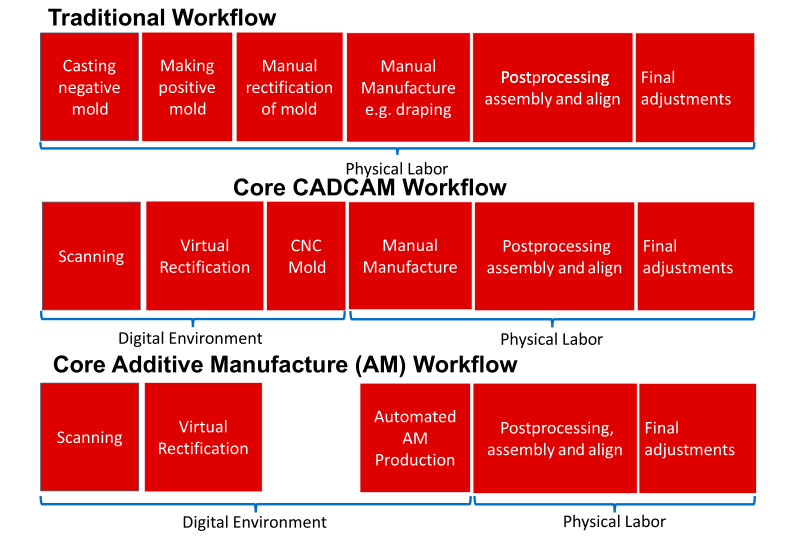

Figura 2.3 — Fluxo digital entre aquisição, CAD/CAM e fabrico aditivo em próteses e ortóteses.

Fonte original (APA 7): Chainando, N., Faephu, C., Suwaphong, N., Bureerat, S., Limphirat, W., Thammajaruk, P., & Syafrudin, M. (2025). Applying 3D scanning and printing techniques to produce upper limb prostheses: Bibliometric analysis and scoping review. Prosthesis, 7(2), 26. https://www.mdpi.com/2673-1592/7/2/26/pdf?version=1740996517

Neste enquadramento, a personalização deixa de ser entendida como exceção e passa a constituir uma estratégia estruturada, operacionalizada através de “seed designs”[^7] ou modelos-base parametrizados. Estes modelos preservam uma arquitetura estável, expondo simultaneamente um conjunto limitado de variáveis ajustáveis, frequentemente acessíveis através de interfaces digitais ou de configuradores destinados a utilizadores não especialistas ([Ozdemir et al., 2022](#ref-ozdemir-2022); [Stralen, 2018](#ref-stralen-2018)).

### Modelação Paramétrica e Espaços de Variação

Os modelos paramétricos desempenham duas funções centrais. Em primeiro lugar, codificam a lógica geométrica do produto — relações, restrições e regras —, assegurando que alterações nos valores dos parâmetros gerem novas variantes sem comprometer a integridade estrutural nem a coerência funcional. Em segundo lugar, permitem explorar espaços de variação extensos, frequentemente descritos como quase contínuos, o que possibilita a criação de famílias de produtos ajustáveis por meio da modificação de variáveis dimensionais ou funcionais ([Lei et al., 2016](#ref-lei-2016); [Ozdemir et al., 2022](#ref-ozdemir-2022)).

No contexto da adaptação ao utilizador, a literatura destaca que a parametrização torna-se particularmente eficaz quando associada a dados mensuráveis, como a antropometria ou as digitalizações tridimensionais. Em vez de um escalonamento uniforme, que pode introduzir desvios significativos, a definição de parâmetros independentes (por exemplo, comprimento e largura) permite ajustes mais precisos e controlo dimensional dentro de margens reduzidas. Em aplicações protésicas, esta abordagem revelou maior proximidade às cinemáticas naturais e melhor adequação morfológica face a modelos simplesmente [^8]escalados ([Lim et al., 2018](#ref-lim-2018)).
### Integração com Fabrico Aditivo e Design for Additive Manufacturing

A eficácia da personalização depende da integração precoce dos constrangimentos do processo de fabrico aditivo no processo de projeto. A literatura sobre Design for Additive Manufacturing (DfAM) sublinha que a incorporação antecipada de limitações de processo — tolerâncias, resistência mecânica, espessuras mínimas, orientação de impressão — reduz falhas de fabrico e encurta os ciclos iterativos ([Chtioui et al., 2023](#ref-chtioui-2023); [Wiberg et al., 2019](#ref-wiberg-2019)).

Estudos aplicados demonstram que, ao determinar experimentalmente constrangimentos do processo e incorporá-los ao modelo paramétrico, é possível gerar milhares de variantes únicas com elevada taxa de sucesso funcional, minimizando as reimpressões ([Wiberg et al., 2019](#ref-wiberg-2019)). [^9]

Esta evidência reforça a necessidade de uma ligação sistemática entre as fases de design e fabrico, contrariando abordagens que tratam o fabrico como etapa posterior e corretiva ([Chtioui et al., 2023](#ref-chtioui-2023); [Wiberg et al., 2019](#ref-wiberg-2019)).

As tecnologias de FA utilizadas incluem FDM/FFF (extrusão de termoplásticos), SLS (fusão seletiva a laser), SLA (estereolitografia) e processos industriais metálicos, o que reflete a diversidade de rotas produtivas para componentes personalizados. Cada tecnologia implica requisitos específicos de projeto, reforçando a importância de integrar critérios técnicos no modelo paramétrico desde o início ([Chtioui et al., 2023](#ref-chtioui-2023); [Wiberg et al., 2019](#ref-wiberg-2019)).[^10]

### Configuradores e Cocriação Digital

A articulação entre modelação paramétrica e interfaces digitais possibilita novos modelos de cocriação e de produção distribuída. Configuradores web ou interfaces baseadas em CAD expõem conjunto delimitado de parâmetros, permitindo ao utilizador ajustar dimensões ou características dentro de intervalos válidos, frequentemente com feedback em tempo real sobre viabilidade ([Ozdemir et al., 2022](#ref-ozdemir-2022); [Stralen, 2018](#ref-stralen-2018)).

A Figura 2.4 mostra um exemplo especialmente relevante desta lógica: a personalização mediada por interface, em que o utilizador atua sobre atributos visuais e formais dentro de um espaço de variação previamente estruturado. Este tipo de configurador ajuda a compreender como a cocriação digital pode ser operacionalizada sem exigir domínio direto de ferramentas CAD complexas.

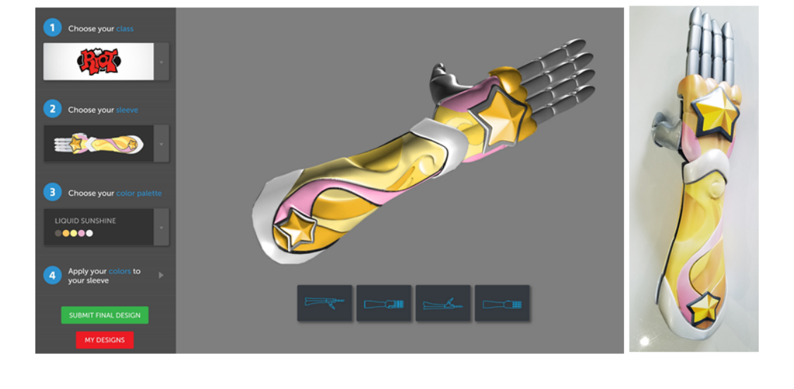

Figura 2.4 — Exemplo de configurador digital para personalização de uma prótese impressa em 3D.

Fonte original (APA 7): Manero, A., Smith, P., Sparkman, J., Dombrowski, M., Courbin, D., Kester, A., Womack, I., & Chi, A. (2019). Implementation of 3D printing technology in the field of prosthetics: Past, present, and future. International Journal of Environmental Research and Public Health, 16, 1641. https://doi.org/10.3390/ijerph16091641

Este modelo “file-to-factory” viabiliza fluxos digitais em que o ficheiro parametrizado é convertido diretamente em instruções de fabrico, seja localmente (impressão 3D descentralizada) ou através de uma encomenda online[^11]. A literatura associa esta lógica à democratização do design e à expansão de estratégias de *mass customization* e *mass personalization*, reduzindo custos marginais ao eliminar a utilização de moldes e dispositivos específicos de [^12]fabrico ([Lei et al., 2016](#ref-lei-2016); [Stralen, 2018](#ref-stralen-2018)).

Contudo, enfatiza-se que configuradores eficazes devem limitar o número de parâmetros expostos e fornecer orientação clara sobre os limites válidos, evitando complexidade excessiva ou escolhas superficiais ([Ozdemir et al., 2022](#ref-ozdemir-2022)).

### Otimização, Geração e Avaliação de Desempenho

A parametrização é frequentemente combinada com métodos de otimização topológica, de geração de estruturas reticuladas e de abordagens multiobjetivo. Estas estratégias permitem gerir compromissos entre peso, resistência, custo e tempo de fabrico, explorando fronteiras de Pareto para selecionar soluções alinhadas com objetivos específicos ([Lei et al., 2016](#ref-lei-2016); [Yao et al., 2016](#ref-yao-2016)).

Em contextos médicos e assistivos, estudos demonstram a integração de modelos paramétricos com análises de elementos finitos (FEM) para validar o desempenho estrutural, bem como de algoritmos generativos que adaptam padrões e estruturas superficiais a geometrias individualizadas ([Lei et al., 2016](#ref-lei-2016); [Lim et al., 2018](#ref-lim-2018)).

Este cruzamento entre parametrização, simulação e FA evidencia um ecossistema digital integrado que sustenta personalização técnica com base quantitativa ([Lei et al., 2016](#ref-lei-2016); [Yao et al., 2016](#ref-yao-2016)).

### Implicações para o Design Industrial

A literatura converge para a ideia de que a robustez do modelo paramétrico é uma condição crítica para a personalização em escala. Modelos mal estruturados ou com dependências inconsistentes podem comprometer a simulação, a otimização e a configuração de famílias de produto ([Lei et al., 2016](#ref-lei-2016); [Wiberg et al., 2019](#ref-wiberg-2019)).

Assim, a qualidade da definição paramétrica desempenha um papel estratégico para a viabilidade de sistemas adaptáveis ([Ozdemir et al., 2022](#ref-ozdemir-2022)).

Em termos económicos, o Fabrico Aditivo permite reduzir [^13]penalizações tradicionais associadas à variação de produto, sustentando modelos de personalização acessíveis. Estudos orientados para famílias de produto indicam que a integração de modelos paramétricos com análises de custo e desempenho pode manter os custos relativamente estáveis mesmo com elevada diversidade geométrica ([Lei et al., 2016](#ref-lei-2016); [Yao et al., 2016](#ref-yao-2016)).

No plano educativo e profissional, recomenda-se a integração de DfAM nos currículos de design industrial, promovendo competências que articulem a conceção, a simulação e o fabrico digital em fluxo contínuo ([Kandikjan et al., 2022](#ref-kandikjan-2022)).

### 2.4 Antropometria aplicada ao design protésico

A antropometria constitui a ponte técnica entre o corpo e a configuração geométrica de uma prótese. No design protésico, a adequação dimensional condiciona conforto, segurança, desempenho funcional e aceitação. A literatura recente descreve uma transição de medições manuais baseadas em marcos anatómicos para processos digitais de captura de superfície, como digitalização 3D e fotogrametria, integrados com CAD/CAM e fabrico aditivo ([Chainando et al., 2025](#ref-chainando-2025)).

Esta transição não elimina a importância das medidas lineares. Comprimentos, larguras, perímetros e proporções continuam a ser essenciais quando se pretende definir um conjunto mínimo de entradas robustas para um modelo paramétrico. A sua limitação é conhecida: a forma tridimensional, a distribuição de volumes, as zonas de pressão e o comportamento dos tecidos não são completamente capturados por medidas escalares. Por isso, em interfaces corpo-dispositivo, como encaixes e zonas de contacto, a literatura valoriza métodos capazes de representar geometria tridimensional e variações locais de forma ([Albin & Molenbroek, 2023](#ref-albin-2023); [Young et al., 2023](#ref-young-2023)).

Mesmo assim, para o objetivo desta investigação, a medição linear mantém valor metodológico. Ela permite estruturar parâmetros comparáveis, definir intervalos plausíveis e testar a coerência de famílias de variantes antes de qualquer validação clínica. A Figura 2.5 ilustra este nível basal, mostrando marcos anatómicos e comprimentos de referência da mão.

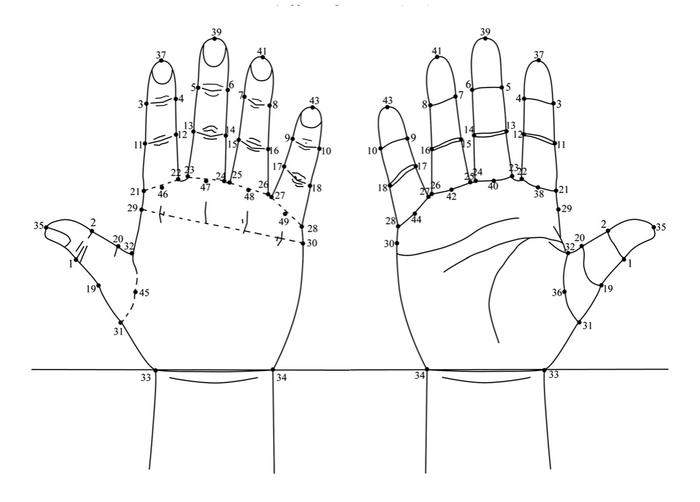

Figura 2.5 — Marcos anatómicos e medidas de referência da mão para fins de personalização.

Fonte original (APA 7): Yu, A., Yick, K. L., Ng, S. P., & Yip, J. (2013). 2D and 3D anatomical analyses of hand dimensions for custom-made gloves. Applied Ergonomics, 44, 381-392.

Os métodos de recolha podem ser agrupados em cinco famílias: medição manual, digitalização 3D, fotogrametria, imagiologia médica e medições complementares da interface, como pressão ou termografia. Nenhum método é universalmente superior. A escolha depende da pergunta de design: medidas lineares são adequadas para parametrização básica e comparação populacional; digitalização 3D e fotogrametria são mais adequadas à captura de forma; imagiologia médica acrescenta informação interna, mas com maior custo e menor acessibilidade; métricas de interface aproximam a medição da experiência real de ajuste, embora ainda tenham barreiras de adoção clínica ([Ibrahim et al., 2024](#ref-ibrahim-2024); [Silva et al., 2024](#ref-silva-2024); [Squibb et al., 2024](#ref-squibb-2024)).

A literatura evidencia ainda duas limitações relevantes para o design inclusivo. Primeiro, muitos estudos aplicados usam amostras pequenas, protocolos heterogéneos e validações curtas. Segundo, continuam escassas as bases de dados antropométricas normalizadas para pessoas com deficiência, o que dificulta estimativas de acomodação em populações sub-representadas ([Bradtmiller, 2022](#ref-bradtmiller-2022)). Assim, os dados antropométricos devem ser usados como referência estruturante e não como substituto da medição individual quando está em causa o ajuste final ao corpo.

No âmbito desta dissertação, o detalhe operacional da base local de medidas da mão e do membro superior distal é deslocado para o Capítulo 4. Esta opção reduz repetição: o Capítulo 2 estabelece o quadro conceptual da antropometria; o Capítulo 4 mostra como esses dados são extraídos, normalizados e convertidos em parâmetros de projeto.

### 2.5 Inteligência Artificial no processo de design

A inteligência artificial tornou-se relevante no design porque introduz novas formas de analisar dados, gerar alternativas, prever desempenho e apoiar decisões. Contudo, a designação “IA” agrega mecanismos distintos: aprendizagem automática, aprendizagem profunda, modelos generativos, visão por computador, processamento de linguagem natural e algoritmos de otimização. Para evitar imprecisão conceptual, esta dissertação trata a IA como conjunto de métodos computacionais baseados em dados, capazes de reconhecer padrões, inferir relações e produzir respostas ou variantes dentro de condições definidas ([Choudhury et al., 2025](#ref-choudhury-2025); [Yüksel et al., 2023](#ref-yuksel-2023)).

A Figura 2.6 enquadra a IA como camada integrada num fluxo CAD mais amplo. A imagem é útil porque evita a leitura da IA como bloco autónomo: recolha de dados, modelação, otimização, avaliação e decisão continuam articuladas com critérios humanos e técnicos.

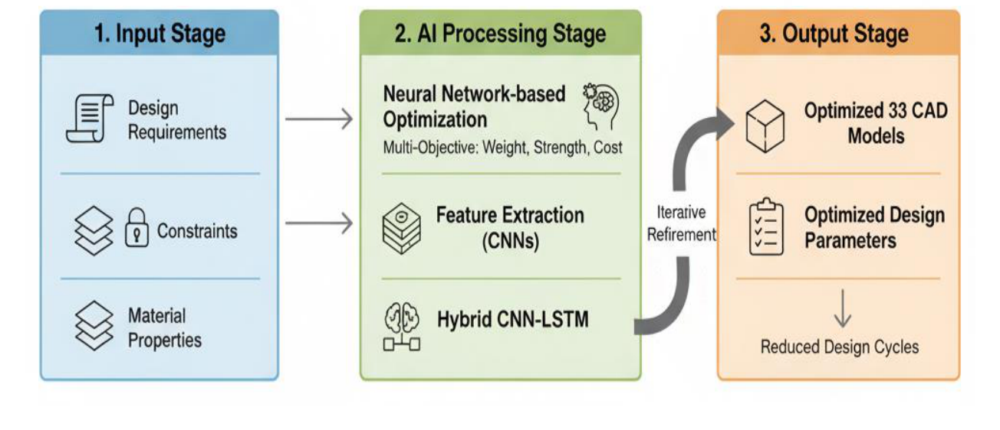

Figura 2.6 — Enquadramento de um fluxo de CAD assistido por IA para desenvolvimento de produto.

Fonte original (APA 7): Menaka, S., Raja, A. W., Ramakrishnan, S., Karthikeswaran, D., Sridar, K., & Sivaranjani, T. (2025). AI-driven computer-aided design (CAD) systems: Leveraging neural networks for optimized engineering product development. International Journal of Applied Mathematics, 38(5s).

No design de produto, a IA pode atuar em diferentes fases: pesquisa e síntese de informação, ideação, geração de variantes, otimização estrutural, simulação, classificação de alternativas e documentação. O seu valor tende a ser maior em tarefas de exploração, análise extensiva e comparação multivariável. Pelo contrário, enquadramento contextual, decisão ética, definição de critérios e validação final continuam dependentes de julgamento humano ([Ao et al., 2025](#ref-ao-2025); [Khanolkar et al., 2023](#ref-khanolkar-2023); [Verganti et al., 2020](#ref-verganti-2020)).

Esta distinção é particularmente importante em dispositivos médicos e tecnologias assistivas. Um sistema de IA pode sugerir combinações plausíveis de parâmetros ou identificar incoerências nos dados, mas não prova, por si só, conforto, segurança, aceitação ou eficácia clínica. Modelos treinados com dados incompletos podem reproduzir enviesamentos, gerar soluções apenas aparentemente adequadas ou tornar opacas as razões de uma recomendação ([Panchal et al., 2019](#ref-panchal-2019); [Yüksel et al., 2023](#ref-yuksel-2023)).

Assim, a posição assumida nesta investigação é deliberadamente assistiva: a IA deve ampliar a capacidade de exploração e apoio à decisão, não substituir o designer, o técnico ou a validação empírica. O Capítulo 6 retoma esta base conceptual e aplica-a ao sistema desenvolvido, distinguindo sugestão paramétrica, validação interna de coerência e validação real da prótese.

### 2.6 Plataformas digitais e sistemas configuráveis

Plataformas digitais configuráveis são infraestruturas sociotécnicas que tornam operável a personalização. Em vez de oferecerem liberdade ilimitada, definnum espaço de variação controlado, onde diferentes agentes podem selecionar, ajustar ou gerar configurações segundo regras explícitas. Esta lógica é central em contextos de saúde e tecnologias de apoio, porque a personalização é frequentemente uma necessidade funcional, e não apenas uma diferenciação de mercado ([Fischer et al., 2004](#ref-fischer-2004); [Hippel & Katz, 2002](#ref-hippel-2002); [Kerr et al., 2024](#ref-kerr-2024)).

Três conceitos ajudam a enquadrar estas plataformas. Os *toolkits for user innovation* transferem parte do trabalho de configuração para utilizadores ou intermediários, mantendo limites definidos por especialistas. O meta-design alarga esta perspetiva ao admitir evolução em uso, em que o sistema pode ser adaptado, reorganizado e consolidado ao longo do tempo. O *end-user development* mostra que utilizadores não programadores podem ajustar sistemas quando as ferramentas são desenhadas de forma compatível com as suas competências e responsabilidades ([Costabile et al., 2007](#ref-costabile-2007); [Fischer et al., 2017](#ref-fischer-2017); [Franke & Hippel, 2002](#ref-franke-2002)).

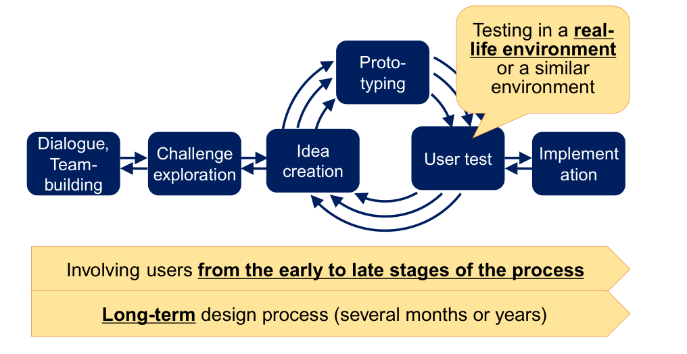

Figura 2.7 — Modelo de processo para configurar participação em ecossistemas de inovação e cocriação.

Fonte original (APA 7): Akasaka, M., Veeckman, C., Georges, A., Schuurman, D., & Coorevits, L. (2022). A framework for configuring participation in living labs. https://www.semanticscholar.org/paper/305d55af5fda06b4d1b33e7d29c1f16d1b7ea488

Tabela 2.2 — Elementos centrais na configuração da participação em sistemas configuráveis

| Dimensão | Questão de projeto |
| --- | --- |
| Fase e propósito | Quando participa o utilizador e com que objetivo |
| Participantes | Que perfis participam e com que responsabilidade |
| Formato | Que canais e métodos suportam a colaboração |
| Contacto | Como se recruta, acompanha e mantém a relação |
| Motivação | Que fatores promovem adesão e que barreiras dificultam continuidade |

Fonte adaptada. Referência original (APA 7): Akasaka, M., Veeckman, C., Georges, A., Schuurman, D., & Coorevits, L. (2022). A framework for configuring participation in living labs. https://www.semanticscholar.org/paper/305d55af5fda06b4d1b33e7d29c1f16d1b7ea488

A personalização pode ocorrer por modularidade, parametrização ou *tailoring*. A modularidade combina componentes interoperáveis; a parametrização traduz dados mensuráveis em variáveis de projeto; o *tailoring* permite ajustes contínuos em conteúdos, rotinas ou preferências. Em dispositivos médicos personalizados, a parametrização é especialmente relevante quando há dados antropométricos e restrições de fabrico que podem ser formalizados num modelo computacional ([Kuhl et al., 2020](#ref-kuhl-2020); [Peters & Richter, 2023](#ref-peters-2023); [Zhu & Zhong, 2022](#ref-zhu-2022)).

A literatura também assinala riscos. A participação pode gerar sobrecarga, a configurabilidade pode dar uma falsa sensação de controlo e a personalização pode colidir com requisitos de segurança, rastreabilidade e regulação. Por isso, plataformas eficazes não se limitam a expor opções: definem permissões, orientam escolhas, registam versões e tornam claro quem decide o quê. Estes princípios fundamentam a plataforma descrita no Capítulo 5 e a discussão de UI/UX desenvolvida no Capítulo 7.

### 2.7 Análise crítica do estado da arte e lacunas identificadas

A transição entre o entusiasmo técnico e a maturidade efetiva do campo torna-se particularmente visível ao se observarem os níveis de prontidão tecnológica na literatura. A Figura 2.8 antecipa esta leitura ao mostrar a distribuição dos estudos por technology readiness level (TRL), reforçando que muitos contributos permanecem concentrados em fases ainda distantes de adoção ampla e sustentada.

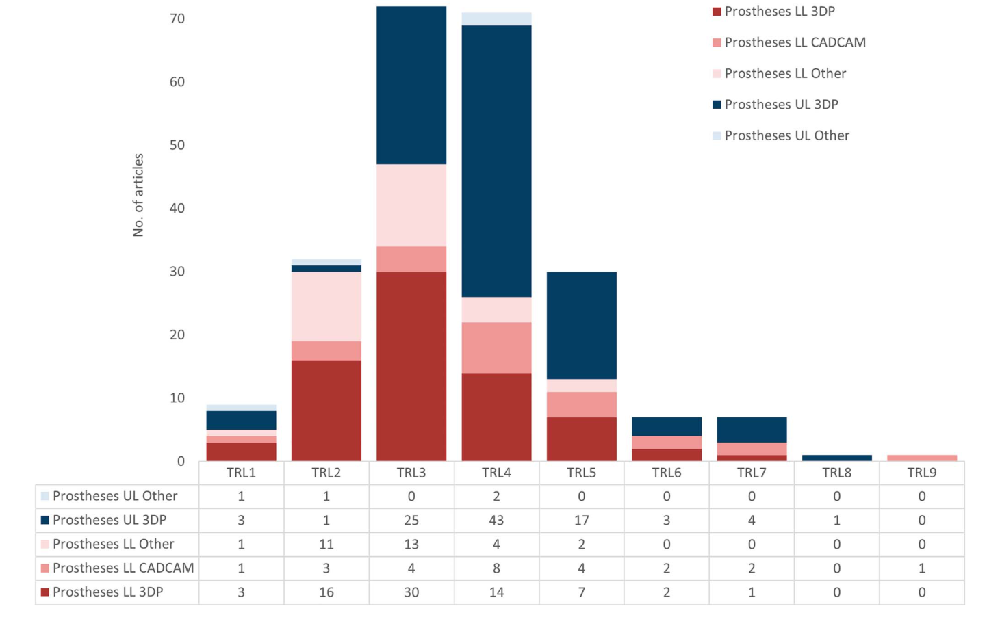

Figura 2.8 — Distribuição dos estudos por nível de prontidão tecnológica (TRL) em próteses e ortóteses com fabrico digital.

Fonte original (APA 7): Chainando, N., Faephu, C., Suwaphong, N., Bureerat, S., Limphirat, W., Thammajaruk, P., & Syafrudin, M. (2025). Applying 3D scanning and printing techniques to produce upper limb prostheses: Bibliometric analysis and scoping review. Prosthesis, 7(2), 26. https://www.mdpi.com/2673-1592/7/2/26/pdf?version=1740996517

A síntese das secções anteriores evidencia um panorama marcado por avanços técnicos significativos, mas também por limitações estruturais persistentes na investigação e no desenvolvimento de próteses e de tecnologias assistivas. Um tema transversal é o desfasamento entre inovação tecnológica e evidência robusta: muitos desenvolvimentos permanecem em fase de protótipo, testados em amostras reduzidas e por períodos curtos, com escassa validação através de ensaios clínicos, estudos longitudinais e avaliações em contextos reais ([Chadwell et al., 2020](#ref-chadwell-2020); [Samuelsson et al., 2012](#ref-samuelsson-2012); [Windrich et al., 2016](#ref-windrich-2016)).

Este padrão enfraquece a capacidade de comparar soluções, generalizar conclusões e traduzir melhorias laboratoriais em benefícios consistentes na vida quotidiana ([Hafner & Sawers, 2016](#ref-hafner-2016); [Samuelsson et al., 2012](#ref-samuelsson-2012)).

### Lacuna 1 — Evidência insuficiente e fraca tradução para o mundo real

A revisão de literatura aponta repetidamente a ausência de estudos comparativos robustos e de ensaios clínicos que confrontem dispositivos avançados com prescrições convencionais, particularmente em sistemas ativos e externamente alimentados. Em vários subdomínios, observa-se dependência de protótipos e de pequenas amostras, o que limita as inferências sobre eficácia, segurança e valor clínico. Em paralelo, verifica-se predominância de avaliações em laboratório e de tarefas pouco representativas, que não captam adequadamente o desempenho em ambientes naturais, com variabilidade de contextos, objetos e exigências funcionais ([Ghillebert et al., 2019](#ref-ghillebert-2019); [Samuelsson et al., 2012](#ref-samuelsson-2012); [Windrich et al., 2016](#ref-windrich-2016)).

Esta lacuna é particularmente relevante porque a adaptação, a aprendizagem e o abandono de próteses ocorrem ao longo do tempo e em ecossistemas reais, como o trabalho, a casa e o espaço público. Quando a evidência se baseia em janelas de observação curtas, torna-se difícil compreender trajetórias de adoção, padrões de uso e emergências de problemas de conforto ou de manutenção ([Chadwell et al., 2020](#ref-chadwell-2020); [Samuelsson et al., 2012](#ref-samuelsson-2012)).

### Lacuna 2 — Desalinhamento entre necessidades identificadas, métricas objetivas, e qualidade de vida

Um problema recorrente é a ligação frágil entre aquilo que os utilizadores referem como necessidades — como conforto, controlo intuitivo, aparência e participação social —, os indicadores objetivos habitualmente medidos — como desempenho em testes funcionais, parâmetros biomecânicos e contagens de atividade  —, e os resultados finais desejáveis — como autonomia e qualidade de vida. Revisões salientam que as necessidades são contextuais e interdependentes e que as medições laboratoriais podem não refletir tarefas relevantes do quotidiano, contribuindo para contradições entre resultados subjetivos e objetivos ([Cordella et al., 2016](#ref-cordella-2016); [Manz et al., 2022](#ref-manz-2022)).

Esta desconexão tem implicações diretas no design: sem métricas ecologicamente válidas e sensíveis às prioridades do utilizador, torna-se difícil orientar decisões de projeto para benefícios significativos e sustentados, podendo ocorrer “melhorias técnicas” que não se traduzem em aceitação ou uso continuado ([Manz et al., 2022](#ref-manz-2022); [Samuelsson et al., 2012](#ref-samuelsson-2012)).

### Lacuna 3 — Persistência de problemas na interface corpo–dispositivo e na personalização

Apesar do progresso em componentes e controlo, a literatura converge para a identificação da interface corpo–dispositivo como um ponto crítico ainda não resolvido. Problemas de ajuste, desconforto, irritação cutânea e dificuldades de adaptação persistem como fatores determinantes de insatisfação e de abandono. Nas revisões, a personalização é frequentemente descrita como insuficiente ou metodologicamente frágil, com evidência difícil de sintetizar devido à variabilidade das intervenções e ao registo incompleto ([Alluhydan et al., 2023](#ref-alluhydan-2023); [Baldock et al., 2023](#ref-baldock-2023); [Richardson & Dillon, 2017](#ref-richardson-2017)).

Um aspeto estruturante desta lacuna é a falta de pipelines “medição → decisão de design → validação” consistentes e acessíveis, com dados objetivos suficientes para orientar ajustes individualizados. Mesmo quando se propõem soluções baseadas em sensores e na monitorização do uso, emergem barreiras práticas, como o custo, a autonomia da bateria, a disponibilidade e a formação, o que limita a adoção como prática clínica padrão ([Chadwell et al., 2020](#ref-chadwell-2020); [Richardson & Dillon, 2017](#ref-richardson-2017)).

### Lacuna 4 — Estagnação e fragilidade metodológica em controlo e interação humano–prótese

No caso das próteses de membro superior, algumas revisões caracterizam uma estagnação relativa nas estratégias de controlo em aplicações comerciais, com evolução lenta desde as primeiras abordagens do século XX. Persistem dificuldades de robustez e de transferibilidade entre cenários laboratoriais e o uso real, bem como desafios associados ao esforço cognitivo, ao tempo de aprendizagem e à inconsistência de desempenho em situações quotidianas ([Cordella et al., 2016](#ref-cordella-2016); [Marinelli et al., 2022](#ref-marinelli-2022)).

Esta lacuna não é apenas técnica: reflete também uma conceptualização insuficiente da interação humano–prótese como um sistema integrado, em que controlo, feedback, treino e contexto de uso devem ser co-otimizados ([Domínguez-Ruiz et al., 2023](#ref-dominguez-ruiz-2023); [Marinelli et al., 2022](#ref-marinelli-2022)).

### Lacuna 5 — Acesso, custo, manutenção e inequidades sistémicas

A acessibilidade surge como um constrangimento central e persistente, tanto em contextos de baixos recursos quanto em sistemas de saúde mais robustos. Revisões identificam barreiras associadas a custos elevados, à necessidade de formação especializada, a atrasos na prestação de cuidados e a pressões sistémicas que levam os utilizadores a negociar intensivamente para obter soluções adequadas. Em contextos de baixos e médios rendimentos, enfatizam-se ainda problemas de durabilidade e de manutenção, com trade-offs claros: soluções biomecanicamente mais sofisticadas podem ser mais frágeis e difíceis de manter, comprometendo a sustentabilidade do uso ([Alluhydan et al., 2023](#ref-alluhydan-2023); [Andrysek, 2010](#ref-andrysek-2010); [Baumann & Maria, 2023](#ref-baumann-2023)).

Assim, a inovação pode agravar as inequidades ao introduzir dependências de infraestrutura, de apoio técnico e de cadeias de fornecimento indisponíveis para uma parcela significativa da população ([Andrysek, 2010](#ref-andrysek-2010); [Segura et al., 2024](#ref-segura-2024)).

### Lacuna 6 — Envolvimento do utilizador e registo metodológico insuficiente

O envolvimento do utilizador é descrito como um problema metodológico e ético ainda não resolvido. Revisões relacionam explicitamente processos pouco patient-tailored ao abandono e à incapacidade de responder às necessidades relevantes. Em várias áreas, identifica-se a ausência de métodos qualitativos sistemáticos para captar a experiência e a aceitabilidade, mesmo em componentes centrados no conforto, como liners, o que limita a compreensão profunda dos fatores de uso e de rejeição ([Marinelli et al., 2022](#ref-marinelli-2022); [Richardson & Dillon, 2017](#ref-richardson-2017); [Walker et al., 2019](#ref-walker-2019)).

Adicionalmente, a heterogeneidade de métodos e a falta de critérios comuns de avaliação, como escalas partilhadas de utilidade e satisfação, dificultam a síntese e as meta-análises, mantendo o campo fragmentado e com baixa comparabilidade ([Cordella et al., 2016](#ref-cordella-2016); [Hafner & Sawers, 2016](#ref-hafner-2016); [Richardson & Dillon, 2017](#ref-richardson-2017)).

### Implicações para esta investigação

Em conjunto, estas lacunas apontam para a necessidade de abordagens que:

1. reforcem a ligação entre personalização e evidência, com pipelines integrados de aquisição de dados, geração de variantes e validação;

2. privilegiem avaliação ecologicamente válida e longitudinal, aproximando métricas de resultados de participação e qualidade de vida;

3. tratem a interface corpo–dispositivo e o conforto como requisitos estruturantes, não como otimizações posteriores;

4. incorporem envolvimento do utilizador como elemento contínuo e reportável, articulando métodos qualitativos e quantitativos;

5. considerem a acessibilidade, a manutenção e o contexto de serviço como parte do problema de design ([Anderson et al., 2024](#ref-anderson-2024); [Baumann & Maria, 2023](#ref-baumann-2023); [Chadwell et al., 2020](#ref-chadwell-2020)).

## Capítulo 3 — Metodologia de Investigação

### 3.1 Enquadramento metodológico e abordagem Research Through Design

A investigação adota uma metodologia aplicada assente em Research Through Design (RTD). Nesta abordagem, o design não é apenas a etapa que materializa uma solução previamente definida; é também o meio através do qual o problema é formulado, testado e compreendido. Conceber, modelar, prototipar e refletir constituem, por isso, atos simultaneamente projetuais e investigativos ([Frayling, 1994](#ref-frayling-1994); [Zimmerman et al., 2007](#ref-zimmerman-2007)).

Esta escolha é adequada porque a personalização de próteses envolve variáveis anatómicas, funcionais, simbólicas e produtivas que não podem ser resolvidas apenas por revisão teórica. O artefacto paramétrico, a plataforma digital e os protótipos funcionam como instrumentos de investigação: tornam visíveis dependências, limites, compromissos e decisões que de outro modo permaneceriam abstratos.

A organização geral inspira-se no modelo Double Diamond, articulando momentos de divergência e convergência nas fases de descoberta, definição, desenvolvimento e entrega. O modelo é usado como orientação processual, não como sequência rígida, permitindo ciclos iterativos de pesquisa, modelação, teste e revisão ([Design Council, 2020](#ref-design-council-2020)).

### 3.2 O design industrial como prática investigativa

O projeto entende o Design Industrial como disciplina capaz de mediar entre inovação tecnológica, corpo e experiência humana. No domínio das próteses de membro superior, essa mediação é particularmente relevante porque o objeto projetado afeta autonomia, identidade, aceitação social e desempenho quotidiano. Esta perspetiva aproxima-se da noção de *designerly ways of knowing*, segundo a qual o design possui modos próprios de formular problemas e produzir conhecimento através da configuração de artefactos ([Cross, 1982](#ref-cross-1982)).

A hipótese de trabalho é que um sistema paramétrico assistido por inteligência artificial pode tornar a personalização mais acessível e reprodutível, desde que a IA permaneça enquadrada por regras geométricas explícitas, critérios de fabrico e supervisão humana. A contribuição esperada não é apenas uma prótese ou uma interface, mas um processo de projeto mais rastreável, criticável e transferível.

### 3.3 Estrutura metodológica do projeto

A metodologia organiza-se em três fases interligadas.

1. A fase conceptual consolida o enquadramento teórico, identifica lacunas no estado da arte e define requisitos para personalização, antropometria, fabrico aditivo, participação e IA assistiva. Inclui também a análise de soluções *open source* existentes e a preparação da base local de dados antropométricos.

2. A fase metodológica define e implementa o sistema: modelo paramétrico, arquitetura da plataforma, lógica de configuração, estrutura de dados, integração OpenSCAD/WASM e camada assistiva de IA.

3. A fase empírica testa o sistema com perfis antropométricos provenientes de bases públicas e com protótipos produzidos por impressão 3D. A avaliação incide sobre coerência dimensional, fabricabilidade, montagem, robustez preliminar, rastreabilidade e clareza do processo de configuração.

### 3.4 Métodos de recolha e análise de dados

A recolha e análise de dados combinam revisão da literatura, análise de precedentes, construção paramétrica, prototipagem iterativa e reflexão crítica sobre cada ciclo. Os dados empíricos do projeto são sobretudo técnicos e projetuais: valores antropométricos públicos, parâmetros geométricos, relações dimensionais, tempos de fabrico, consumo de material, problemas de montagem e comportamento dos protótipos.

Não são recolhidos dados pessoais ou biométricos de utilizadores reais. A base local consolidada de medidas da mão e do membro superior distal funciona como infraestrutura intermédia para selecionar, comparar e normalizar medidas relevantes. A sua organização preserva país, amostra, tipo de medida, estatística, fonte documental, unidade e notas de qualidade, permitindo auditar a passagem entre fonte, parâmetro e decisão de projeto.

Embora o estudo não inclua participantes reais, a literatura metodológica ajuda a enquadrar a recolha dimensional aplicada a próteses impressas em 3D. A Figura 3.1 apresenta um precedente deste tipo de procedimento, usado aqui apenas como referência metodológica.

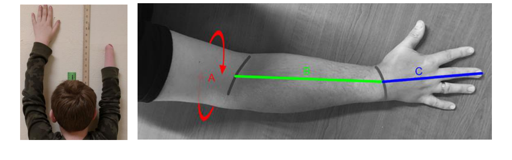

Figura 3.1 — Exemplo de recolha dimensional para ajuste de prótese impressa em 3D.

Fonte original (APA 7): Kellam, S. M., Boleneus, G. J., Stewart, J., Richter, D. C., Michaelis, B. M., & Gerlick, R. E. (2019). An undergraduate engineering service learning project involving 3D-printed prosthetic hands for children. In American Society for Engineering Education Annual Conference & Exposition Proceedings.

### 3.5 Critérios de avaliação e limitações metodológicas

A avaliação do sistema considera critérios técnicos, funcionais e metodológicos: capacidade de personalização paramétrica, consistência dimensional perante diferentes perfis, viabilidade de fabrico por impressão 3D, robustez estrutural preliminar, clareza do processo de configuração, rastreabilidade das decisões e possibilidade de replicação por técnicos não especializados.

As limitações são assumidas desde o início. A ausência de testes com utilizadores reais impede validação clínica, avaliação aprofundada da experiência subjetiva e prova de conforto. A utilização de dados antropométricos secundários limita a verificação da adaptação individual. A IA é circunscrita a funções de apoio à configuração, interpretação e validação interna; não é tratada como sistema clínico autónomo. Assim, os resultados devem ser lidos como contributo metodológico e prototípico no domínio do Design Industrial, e não como demonstração final de eficácia terapêutica.

## Capítulo 4 — Desenvolvimento do Modelo Paramétrico

### 4.1 Definição do problema de design e requisitos

A definição do problema de design parte das lacunas identificadas no Capítulo 2 e da estrutura metodológica definida no Capítulo 3. O desafio não é apenas reproduzir a forma da mão, mas configurar um dispositivo que concilie funcionalidade, conforto, leveza, fiabilidade, controlo inteligível, aceitabilidade estética, manutenção e viabilidade económica. A literatura sobre próteses de membro superior mostra que as taxas de abandono continuam associadas a desconforto, peso, baixa robustez, limitação funcional e controlo pouco intuitivo ([Biddiss et al., 2007](#ref-biddiss-2007); [Cordella et al., 2016](#ref-cordella-2016); [Peerdeman et al., 2011](#ref-peerdeman-2011)).

Para transformar este problema em sistema paramétrico, os requisitos foram organizados em cinco grupos. Os requisitos funcionais abrangem padrões de preensão, amplitude de movimento, montagem e capacidade de executar tarefas quotidianas. Os requisitos ergonómicos incluem conforto, baixo peso, facilidade de colocação e adequação ao uso prolongado. Os requisitos técnicos dizem respeito a materiais, mecanismos, tolerâncias, sensores, atuadores e estratégias de controlo. Os requisitos produtivos incluem modularidade, reparabilidade, custo e compatibilidade com fabrico aditivo. Por fim, os requisitos estéticos e psicossociais relacionam-se com identidade, aceitação social e apropriação do dispositivo ([Brack & Amalu, 2021](#ref-brack-2021); [Henao et al., 2025](#ref-henao-2025); [Walker et al., 2019](#ref-walker-2019)).

A etapa crítica é traduzir necessidades qualitativas em parâmetros verificáveis. Conforto, segurança ou facilidade de controlo precisam de correspondência com valores ou regras: limites de peso, folgas, tolerâncias, espessuras mínimas, amplitude articular, distribuição de pressão, autonomia ou restrições de montagem. Em contexto paramétrico, esta tradução torna-se explícita porque cada variável deve ter função, intervalo e consequência geométrica definidos ([Hofmann et al., 2016](#ref-hofmann-2016); [Jones et al., 2023](#ref-jones-2023)).

Deste modo, a definição dos requisitos não é repetição do enquadramento teórico, mas a sua operacionalização: seleciona-se o que entra no modelo, o que permanece como restrição, o que depende de avaliação posterior e o que não pode ser legitimamente resolvido por parametrização automática.

### 4.2 Parâmetros antropométricos e estrutura do modelo

A definição e operacionalização de parâmetros antropométricos constitunum elemento central no desenvolvimento de sistemas protésicos personalizados, funcionando como a principal interface entre o corpo do utilizador e a configuração geométrica e funcional do modelo paramétrico. No contexto das próteses de membro superior, estes parâmetros não se limitam a medições isoladas, mas integram um sistema estruturado de variáveis que descrevem a morfologia da mão, dos dedos, do punho e, quando aplicável, do antebraço ou do membro residual. A literatura recente converge em dois pontos: a personalização eficaz depende de medidas anatomicamente relevantes e não de escalonamentos genéricos; e essas medidas devem ser organizadas de forma a alimentar diretamente a lógica do modelo digital ([Chatzioglou et al., 2024](#ref-chatzioglou-2024); [Moreo, 2016](#ref-moreo-2016); [Rodríguez-Vega & Rodríguez-Vega, 2024](#ref-rodriguez-vega-2024)).

Esta exigência de organizar as medições em parâmetros operáveis é particularmente evidente nos modelos digitais do dedo e da mão. A Figura 4.1 mostra um exemplo de decomposição paramétrica em comprimentos, larguras e secções articulares, o que clarifica o tipo de estrutura dimensional que sustenta a transição da antropometria para a geometria configurável.

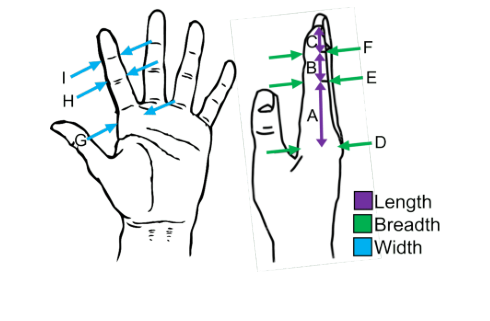

Figura 4.1 — Parâmetros antropométricos utilizados na modelação paramétrica de dedos protésicos.

Fonte original (APA 7): Nini, L., Ceccarelli, A., Tagliamonte, N., Zollo, L., & Taffoni, F. (2024). Parametric 3D modeling of a customized prosthetic hand finger for additive manufacturing. In 2024 10th IEEE RAS/EMBS International Conference for Biomedical Robotics and Biomechatronics (BioRob). IEEE. https://doi.org/10.1109/BioRob60516.2024.10719909

Os parâmetros antropométricos mais relevantes concentram-se, em primeiro lugar, na definição da estrutura dimensional base da mão. Medidas como o comprimento da mão, a largura da mão e o comprimento da palma constituem descritores dimensionais primários, permitindo estabelecer a escala do modelo e definir a sua organização geral. Para além destas, incluem-se parâmetros relativos aos dedos, como comprimentos segmentares e proporções entre falanges, bem como as dimensões do polegar e do punho, essenciais para a funcionalidade e a integração do dispositivo ([Chatzioglou et al., 2024](#ref-chatzioglou-2024); [Nag et al., 2003](#ref-nag-2003)).

Tabela 4.1 — Principais parâmetros antropométricos da mão e do membro superior relevantes para modelação paramétrica

| Mão | Comprimento da mão | Distância do punho à ponta do dedo médio | Escala global do modelo |
| --- | --- | --- | --- |
| Mão | Largura da mão | Distância entre metacarpos II e V | Definição do volume da palma |
| Palma | Comprimento da palma | Base do dedo médio até ao punho | Estrutura e proporção da palma |
| Dedos | Comprimento dos dedos | MCP até ponta | Dimensionamento funcional |
| Dedos | Proporções falângicas | Relação entre segmentos | Definição cinemática |
| Dedos | Largura/profundidade | Secção transversal | Ajuste estrutural e estético |
| Polegar | Comprimento e orientação | Geometria e oposição | Preensão e usabilidade |
| Punho | Largura/profundidade | Dimensões do punho | Interface estrutural |
| Antebraço | Circunferência/comprimento residual | Medidas do membro residual | Ajuste do encaixe |

### Conjuntos mínimos de parâmetros por nível de amputação

A definição de um conjunto mínimo de parâmetros antropométricos depende diretamente do nível de amputação, uma vez que diferentes configurações protésicas exigem graus distintos de detalhe. Em termos práticos, reduzir o número de medições necessárias é importante para viabilizar processos de personalização mais escaláveis, sobretudo quando a recolha de dados ocorre fora de contextos clínicos altamente especializados ([Moreo, 2016](#ref-moreo-2016); [da Silveira Romero et al., 2025](#ref-da-silveira-romero-2025)).

Tabela 4.2 — Conjuntos mínimos de parâmetros por nível de amputação

| Transradial (abaixo do cotovelo) | Comprimento do membro residual, circunferência do antebraço, largura do punho |
| --- | --- |
| Desarticulação do punho | Largura e profundidade do punho, comprimento da mão |
| Parcial da mão | Comprimento da palma, dimensões dos dedos remanescentes |
| Dedos (parcial) | Comprimento e largura do dedo, proporções falângicas |
| Mão completa (cosmética/funcional) | Comprimento da mão, largura da palma, comprimento dos dedos |

Esta abordagem permite estruturar o sistema paramétrico com base em entradas (inputs) essenciais, reduzindo a complexidade sem comprometer a funcionalidade. Importa, contudo, distinguir entre parâmetros mínimos de configuração e parâmetros de refinamento: os primeiros permitem gerar uma instância funcional do modelo; os segundos melhoram o ajuste, a coerência proporcional ou o desempenho cinemático quando há dados adicionais disponíveis.

### Limitações do escalonamento uniforme

Uma limitação recorrente em abordagens simplificadas de modelação é o uso de escalonamento uniforme (uniform scaling), no qual um modelo base é dimensionado proporcionalmente em todas as direções. Esta abordagem revela-se inadequada no contexto antropométrico, uma vez que as dimensões da mão apresentam correlações imperfeitas entre si e variam de forma desigual entre populações, sexos e grupos etários. Em consequência, indivíduos com largura de mão semelhante podem apresentar comprimentos digitais, proporções falângicas ou dimensões do polegar significativamente diferentes. A modelação paramétrica exige, por isso, a definição de parâmetros independentes e a possibilidade de derivar proporções locais sem pressupor homotetia global do modelo ([Lim et al., 2018](#ref-lim-2018); [Nag et al., 2003](#ref-nag-2003); [Rodríguez-Vega & Rodríguez-Vega, 2024](#ref-rodriguez-vega-2024)).

Esta limitação torna-se visualmente evidente na Figura 4.2, que compara um modelo uniformemente escalado com outro parametrizado a partir de variáveis independentes. A diferença é relevante porque mostra que a personalização não depende apenas de “aumentar ou reduzir” um modelo-base, mas também de reorganizar as relações geométricas internas.

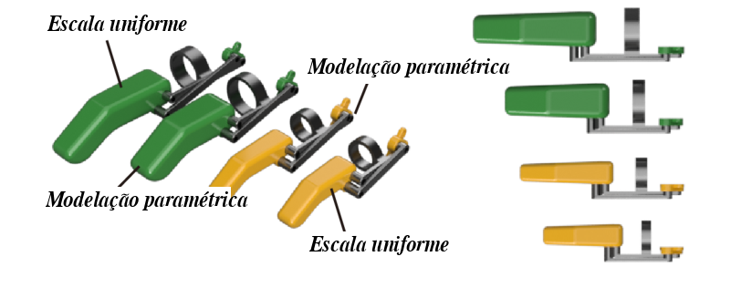

Figura 4.2 — Comparação entre o escalonamento uniforme e a modelação paramétrica de dedo protésico.

Fonte original: Lim, D., Georgiou, T., Bhardwaj, A., O'Connell, G. D., & Agogino, A. M. (2018, August 26). Customization of a 3D printed prosthetic finger using parametric modeling. In Proceedings of the ASME 2018 International Design Engineering Technical Conferences and Computers and Information in Engineering Conference. https://doi.org/10.1115/DETC2018-85645

### Métodos de recolha de dados antropométricos

A recolha de dados pode ser realizada por diferentes métodos, com implicações diretas na precisão e na aplicabilidade dos modelos. A escolha do método depende do objetivo da medição: parametrização dimensional básica, reconstrução geométrica fina, desenho do encaixe ou obtenção de relações internas entre superfícies e estruturas ósseas. Em termos práticos, a literatura mostra que não há um método universalmente superior; há, sim, uma adequação diferencial entre método, custo, acessibilidade e tipo de dado necessário ([Çıklaçandır et al., 2022](#ref-cklacandr-2022); [Herbst et al., 2021](#ref-herbst-2021)).

Tabela 4.3 — Métodos de recolha de dados antropométricos e suas características

| Medição manual | Dimensões lineares | Simplicidade, baixo custo | Representação geométrica limitada | Parametrização básica |
| --- | --- | --- | --- | --- |
| Digitalização 3D | Geometria superficial | Elevada precisão, rapidez | Equipamento e processamento necessários | Encaixe e forma |
| Imagiologia médica | Estrutura interna e externa | Dados anatómicos detalhados | Alto custo e menor acessibilidade | Modelação biomecânica |
| Fotogrametria | Geometria aproximada | Acessível, potencial remoto | Precisão variável | Aquisição preliminar |

### Bases de dados antropométricas, extração e normalização

A definição de parâmetros pode apoiar-se em bases de dados antropométricas de referência e em normas de medição corporal, que ajudam a estabilizar a nomenclatura, os pontos anatómicos e os intervalos esperados de variação. No presente projeto, esse apoio foi operacionalizado através da consolidação local de dados provenientes de estudos populacionais e de bases de referência. O conjunto reunido contém 1.790 registos em formato longo, cobre nove países — China, Estados Unidos da América, Índia, Jordânia, México, Nigéria, Países Baixos, Portugal e Turquia — e combina dados de estudos publicados, relatórios técnicos e sub-bases DINED disponibilizadas pela TU Delft.

O objetivo desta consolidação não foi criar uma nova norma antropométrica, nem substituir a medição individual do utilizador. O objetivo foi construir uma infraestrutura intermédia, verificável e comparável, capaz de apoiar três decisões de projeto: definir intervalos plausíveis para os parâmetros expostos no modelo; identificar quais dimensões são suficientemente recorrentes na literatura para servirem como entradas mínimas; e testar a coerência geométrica de configurações geradas a partir de diferentes perfis populacionais. Esta distinção é importante porque os dados populacionais descrevem tendências e dispersões, enquanto uma prótese personalizada continua a exigir medições diretas ou digitalização específica quando o ajuste final ao corpo está em causa.

A seleção das fontes seguiu critérios explícitos. Foram incluídas fontes que apresentavam dados primários ou bases de dados reconhecidas, pelo menos uma dimensão relevante para a mão, dedos, palma, punho ou antebraço, identificação da população ou subgrupo e estatística descritiva legível. Foram excluídos estudos que apenas reutilizavam dados secundários sem acesso claro à fonte original, artigos de engenharia que mencionavam dimensões de forma incidental, exemplos baseados num único sujeito e fontes sem informação suficiente sobre população, método ou unidade. Esta decisão explica, por exemplo, a exclusão dos valores percentílicos reproduzidos por Moreo (2016) a partir da base DINED: apesar de o trabalho ser relevante para a lógica de parametrização, a tabela não constitui recolha primária autónoma e seria metodologicamente redundante quando a fonte DINED podia ser tratada diretamente ([Moreo, 2016](#ref-moreo-2016)).

Tabela 4.4 — Fontes integradas na base local de dados antropométricos

| Fonte | População e cobertura | Dados extraídos | Registos |
| --- | --- | --- | --- |
| DINED kima1993, TU Delft | Crianças neerlandesas, 2–12 anos | Médias e desvios-padrão de medições da mão por idade e sexo | 528 |
| DINED geron1998, TU Delft | Idosos neerlandeses, 50–80+ anos | Médias e desvios-padrão de medições da mão por grupos etários | 210 |
| DINED dined2004, TU Delft | Adultos neerlandeses, 20–60+ anos | Médias e desvios-padrão de medições da mão por sexo e idade | 114 |
| Rodríguez-Vega e Rodríguez-Vega (2024) | População mexicana, 15–59 anos | Comprimento da mão, comprimento da palma, largura da mão e diâmetro de preensão, com valores gerais e por grupos etários | 360 |
| Nag et al. (2003) | Mulheres indianas trabalhadoras | 51 dimensões da mão, incluindo comprimentos, larguras, circunferências, profundidades e aberturas | 255 |
| Gordon et al. (2015) | Militares norte-americanos do ANSUR II | Medições da mão, punho e antebraço extraídas das estatísticas públicas do inquérito | 154 |
| Chatzioglou et al. (2024) | Jovens adultos da Turquia | Comprimentos dos cinco dedos da mão direita, por sexo e combinado | 56 |
| Hu et al. (2007) | Idosos chineses da área de Pequim | Larguras, comprimento da mão, comprimento do dedo e comprimento antebraço-ponta dos dedos | 50 |
| Ibiwari et al. (2025) | Atletas universitários da Nigéria | Comprimento da mão, largura da mão, comprimento palmar e 3.º dedo, por modalidade e sexo | 32 |
| Anacleto Filho et al. (2023) | Trabalhadores industriais portugueses | Comprimento e largura da mão, por sexo | 20 |
| Mistarihi (2020) | Trabalhadores com deficiência física na Jordânia | Comprimento da mão, largura da mão e comprimento cotovelo-ponta dos dedos | 9 |
| Lim et al. (2018) | Adultos jovens nos EUA | Comprimento e largura do dedo indicador para customização de dedo protésico | 2 |

A extração foi realizada a partir das tabelas dos artigos e, quando aplicável, da interface estruturada das bases de dados. Nos artigos científicos, a leitura concentrou-se em duas zonas: a metodologia, para identificar instrumento, postura, mão medida e pontos anatómicos; e os resultados, para localizar as tabelas com médias, desvios-padrão, percentis, mínimos e máximos. Cada valor foi transcrito para uma estrutura comum que preserva a fonte documental, a página, a citação, o nome da medida, a região corporal, o protocolo de medição, a população, o país, o sexo, o grupo etário, a dimensão amostral, o tipo de estatística, as unidades convertidas e uma nota de qualidade quando necessário. A decisão de preservar simultaneamente a fonte, a página, a população e a nota metodológica torna cada valor auditável e permite regressar ao documento original sempre que uma medida pareça incoerente.

A opção pelo formato longo foi deliberada. Em vez de criar uma linha por dimensão com colunas fixas para média, desvio-padrão e percentis, cada estatística foi registada como uma linha própria. Assim, uma mesma dimensão pode originar várias linhas para média, desvio-padrão, P5, P50, P95, mínimo ou máximo. Este formato facilita a integração de fontes incompletas, porque nem todos os estudos reportam o mesmo conjunto de estatísticas. Na base atual, existem 612 médias, 609 desvios-padrão, 513 percentis, 28 mínimos e 28 máximos. Esta assimetria é metodologicamente relevante: os datasets ANSUR e algumas fontes DINED permitem uma leitura estatística mais ampla, enquanto estudos como Mistarihi (2020) ou Lim et al. (2018) só oferecem valores parciais, úteis como referência contextual mas insuficientes para inferência populacional robusta ([Gordon et al., 2015](#ref-gordon-2015); [Lim et al., 2018](#ref-lim-2018); [Mistarihi, 2020](#ref-mistarihi-2020)).

As principais dificuldades encontradas dizem respeito à heterogeneidade dos protocolos. A expressão “comprimento da mão”, por exemplo, nem sempre corresponde ao mesmo trajeto anatómico: alguns estudos usam a prega do punho, outros o processo estilóide, e outros definem o comprimento a partir de marcos funcionais da palma. Do mesmo modo, há estudos que medem a mão direita, outros a mão dominante, e o estudo português mede a mão esquerda por constrangimentos de recolha ([Anacleto Filho et al., 2023](#ref-anacleto-filho-2023)). Estas diferenças impedem tratar todas as entradas como equivalentes diretas e justificam o registo explícito do protocolo de medição. A base não apaga a heterogeneidade; torna-a explícita para que o modelo paramétrico possa usar os dados de forma informada.

Houve também dificuldades de granularidade e representatividade. Algumas fontes são estatisticamente fortes, mas pouco específicas para a mão; outras são ricas em medidas da mão, mas limitadas a uma população muito particular. Nag et al. (2003), por exemplo, fornece uma cobertura dimensional muito detalhada, mas apenas para mulheres indianas trabalhadoras. Rodríguez-Vega e Rodríguez-Vega (2024) oferecnuma amostra mexicana numerosa e grupos etários úteis, mas concentram-se em quatro dimensões principais. Ibiwari et al. (2025) acrescenta dados africanos, mas a amostra é composta por atletas universitários, não por população geral. Mistarihi (2020) é relevante por incluir trabalhadores com deficiência física, mas apresenta poucos registos, sem desagregação suficiente por sexo. Estes casos foram mantidos porque aumentam a diversidade de referência, mas as suas limitações foram registadas nos metadados da população, da dimensão amostral e da qualidade do dado.

Em sentido inverso, algumas fontes facilitaram a extração. As tabelas com percentis claros, unidades explícitas e separação por sexo ou idade permitiram codificação direta e maior confiança. A estrutura HTML da DINED facilitou a recuperação sistemática de médias e desvios-padrão por sub-base, sexo e grupo etário, embora não disponibilize percentis na mesma interface. O ANSUR II também foi particularmente útil por disponibilizar estatísticas amplas e uma grande amostra militar, permitindo trabalhar com medições da mão, punho e antebraço em escala populacional ([Gordon et al., 2015](#ref-gordon-2015); [Molenbroek, 1998](#ref-molenbroek-1998); [Molenbroek et al., 2003](#ref-molenbroek-2003); [Steenbekkers & van Beijsterveldt, 1998](#ref-steenbekkers-1998)). Ainda assim, estas fontes não resolvem o problema da personalização clínica: militares, crianças neerlandesas ou idosos chineses não representam automaticamente utilizadores com amputação de membro superior.

As decisões de normalização seguiram quatro princípios. Primeiro, todas as unidades foram convertidas para milímetros, centímetros e polegadas, mantendo uma unidade-fonte única para evitar conversões ambíguas no momento de utilização. Segundo, valores provenientes de subgrupos muito pequenos, figuras em vez de tabelas, desvios-padrão atípicos ou definições anatómicas incertas foram preservados, mas assinalados em notas de qualidade, em vez de serem eliminados sem rasto. Terceiro, as medidas foram agrupadas por região corporal, para distinguir dimensões diretamente ligadas à geometria da mão de dimensões úteis apenas para a interface com o punho ou antebraço. Quarto, os dados foram tratados como referências paramétricas e não como prescrições dimensionais finais.

Esta base faz sentido para o projeto porque responde a uma necessidade específica do modelo desenvolvido: transformar uma discussão genérica sobre personalização em intervalos, relações e restrições utilizáveis. O modelo precisa de saber que medidas são recorrentes na literatura, que variações são plausíveis entre populações, que dimensões podem servir como entradas mínimas e onde o escalonamento uniforme se torna arriscado. A base local permite comparar comprimento da mão, largura da palma, comprimentos digitais, dimensões do punho e relações com o antebraço de forma rastreável. Por isso, ela sustenta a passagem entre o enquadramento antropométrico e a modelação em OpenSCAD: os dados não geram a prótese por si só, mas delimitam o espaço de variação no qual o modelo pode operar com maior coerência.

Permanece, contudo, uma limitação central. A maior parte dos dados disponíveis provém de populações sem amputação e não descreve a morfologia do membro residual, nem a interação dinâmica entre tecido, carga e encaixe. Para uma prótese definitiva, a referência mais adequada seria a medição direta do utilizador, idealmente complementada por digitalização tridimensional e validação de interface. Nesta investigação, os dados antropométricos públicos são usados para estruturar o sistema, testar coerência dimensional e fundamentar decisões de parametrização; não são apresentados como substituto de avaliação clínica, prova de conforto ou validação individual.

### Estrutura paramétrica e mapeamento de parâmetros

A estrutura do modelo paramétrico organiza os parâmetros segundo uma lógica hierárquica e relacional, distinguindo entre parâmetros primários, derivados, funcionais e construtivos. Esta distinção é metodologicamente importante porque impede que o modelo seja tratado como um conjunto plano de medidas independentes. Em vez disso, estabelece-se uma cadeia de transformação em que algumas variáveis funcionam como entradas principais do utilizador e outras como consequências geométricas, cinemáticas ou produtivas dessas entradas ([Moreo, 2016](#ref-moreo-2016); [da Silveira Romero et al., 2025](#ref-da-silveira-romero-2025)).

Tabela 4.5 — Estrutura hierárquica dos parâmetros no modelo paramétrico

| Primários | Comprimento da mão, largura da palma | Input direto | Independentes |
| --- | --- | --- | --- |
| Derivados | Proporções das falanges | Construção geométrica | Dependentes |
| Funcionais | Amplitude de movimento, posição articular | Desempenho | Ligação cinemática |
| Construtivos | Espessuras, folgas, tolerâncias | Fabrico | Ajuste técnico |

A tradução destes parâmetros em geometria é realizada através de relações explícitas entre medições e componentes do modelo.

Tabela 4.6 — Mapeamento entre parâmetros antropométricos e elementos do modelo

| Comprimento da mão | Escala geral e comprimento dos dedos |
| --- | --- |
| Largura da palma | Volume da palma e espaçamento entre dedos |
| Comprimento dos dedos | Geometria das falanges |
| Circunferência do antebraço | Geometria do encaixe |
| Largura do punho | Interface palma-punho |
| Proporções falângicas | Relações cinemáticas dos mecanismos digitais |

Este mapeamento constitui a base da modelação paramétrica, permitindo converter dados antropométricos em configurações geométricas e funcionais. Em termos práticos, a passagem de medição para geometria não deve ser entendida como uma transposição linear, mas como a definição de relações controladas: certos parâmetros regulam a escala geral, outros definem proporções locais e outros ainda atuam como restrições de consistência ou de fabricabilidade. Antes de qualquer implementação em código, torna-se necessário estabilizar três níveis: os dados de entrada, as relações entre parâmetros e os limites técnicos que condicionam a sua transformação em forma.

No contexto desta investigação, o papel da secção 4.2 é, portanto, delimitado com clareza: identificar quais são os parâmetros antropométricos relevantes, como são recolhidos ou inferidos, e de que modo se organizam antes de entrarem na estrutura computacional do modelo. A secção seguinte retoma precisamente esta base para mostrar como esse sistema de entradas, dependências e restrições é formalizado em OpenSCAD como um modelo executável, modular e regenerável.

### 4.3 Modelação paramétrica em OpenSCAD

A modelação paramétrica em OpenSCAD corresponde, nesta investigação, ao momento em que a estrutura definida na secção anterior passa de um quadro conceptual a um sistema operativo. Os parâmetros antropométricos selecionados, as relações hierárquicas entre variáveis e os limites de configuração deixam de funcionar apenas como critérios de organização e passam a ser inscritos em código, de modo a gerar geometria de forma consistente e repetível. Assim, a transição para OpenSCAD não representa uma mudança de tema, mas a continuação lógica do mesmo problema: como transformar dados corporais e regras de projeto num modelo configurável que preserve coerência formal, funcional e produtiva.

A modelação paramétrica em OpenSCAD é, por isso, aqui entendida como uma abordagem em que a geometria resulta de regras explícitas, parâmetros definidos em código e relações de dependência entre componentes, em vez de edição manual isolada de formas. Para o desenvolvimento de próteses personalizadas de membro superior, esta lógica é particularmente relevante, pois permite tratar a prótese como uma família configurável de soluções, regenerável com base em novos dados antropométricos, requisitos funcionais e limites de fabrico. A literatura sobre modelação paramétrica aplicada a próteses e sobre CAD baseado em código converge precisamente nesta direção, associando este tipo de abordagem a maior rastreabilidade, repetibilidade e capacidade de automatização em fluxos de personalização digital ([Machado et al., 2019](#ref-machado-2019); [Moreo, 2016](#ref-moreo-2016); [da Silveira Romero et al., 2025](#ref-da-silveira-romero-2025)).

Ao contrário de ambientes centrados na manipulação gráfica direta, o OpenSCAD opera como uma especificação computacional do objeto. Essa característica é metodologicamente relevante para a presente investigação porque torna o modelo não apenas um resultado geométrico, mas também um artefacto explícito de projeto: um sistema em que se registam as relações entre entradas antropométricas, módulos geométricos, restrições construtivas e decisões formais. Neste sentido, a modelação baseada em código articula-se bem com uma perspetiva de Research Through Design, na medida em que o próprio modelo pode ser lido, revisto, testado e documentado como uma estrutura de conhecimento técnico.

### 4.3.1 Estrutura técnica, parâmetros e restrições

A estrutura técnica de um modelo paramétrico baseado em OpenSCAD pode ser compreendida como uma arquitetura em camadas. Numa primeira camada situam-se os dados de entrada, provenientes de medições lineares, de dados consolidados de referência ou de digitalização tridimensional. Numa segunda camada, esses dados são transformados em parâmetros geométricos derivados, responsáveis por estabelecer proporções, espessuras, posições articulares e relações entre subcomponentes. Segue-se uma camada funcional, na qual se definem exigências de mobilidade, montagem ou integração mecânica, e uma camada de restrições produtivas, na qual se enquadram espessuras mínimas, folgas, tolerâncias e limites de fabricabilidade. Esta organização permite controlar a personalização sem comprometer a coerência interna do sistema ([Moreo, 2016](#ref-moreo-2016); [Nini et al., 2024](#ref-nini-2024); [Saldarriaga et al., 2024](#ref-saldarriaga-2024)).

Tabela 4.7 — Estrutura técnica em camadas de um modelo paramétrico em OpenSCAD para próteses personalizadas

| Entrada | Dados antropométricos e/ou dados de digitalização | Individualizar o modelo | Largura da palma, comprimentos digitais, perímetro do coto |
| --- | --- | --- | --- |
| Derivação geométrica | Parâmetros calculados a partir das entradas | Traduzir medidas em relações formais | Comprimentos segmentares, espessuras, offsets |
| Comportamento funcional | Parâmetros ligados ao uso e ao mecanismo | Regular movimento, montagem e desempenho | Amplitude articular, espaço para tendões, eixos |
| Restrições produtivas | Limites de fabrico e consistência | Garantir fabricabilidade e robustez | Espessura mínima, folgas, raios mínimos |

Em OpenSCAD, esta arquitetura tende a materializar-se através de módulos relativamente autónomos. Em vez de concentrar toda a definição geométrica num único bloco de código, o modelo pode ser distribuído em módulos correspondentes à palma, aos dedos, às articulações, às interfaces de fixação ou de encaixe. A modularidade tem aqui duas vantagens diretas: reduz a opacidade do sistema e facilita a regeneração controlada de variantes. Num contexto protésico, isto permite que alterações nos parâmetros de entrada não se propaguem de forma arbitrária a todo o modelo, mas sim segundo relações previamente explícitas e localizáveis ([Machado et al., 2019](#ref-machado-2019); [da Silveira Romero et al., 2025](#ref-da-silveira-romero-2025)).

Outro aspeto central é a integração de restrições diretamente na lógica paramétrica. Em vez de tratar a verificação de fabricabilidade como etapa exclusivamente posterior, o modelo pode incorporar, desde o início, limites mínimos de espessura, folgas entre elementos móveis, margens de tolerância e verificações condicionais para evitar combinações inválidas. Este princípio é particularmente relevante em próteses produzidas por fabrico aditivo, nas quais pequenas alterações dimensionais podem comprometer a montagem, a resistência ou a imprimibilidade. Estudos sobre modelação paramétrica de dedos protésicos e sockets personalizados mostram, precisamente, que a robustez do sistema depende da articulação entre parâmetros antropométricos e restrições construtivas, e não apenas da liberdade de variação geométrica ([Nini et al., 2024](#ref-nini-2024); [Saldarriaga et al., 2024](#ref-saldarriaga-2024)).

Finalmente, a modelação em OpenSCAD pode ser articulada a fluxos de dados mais complexos, incluindo a digitalização tridimensional e a automatização parcial do desenho. Trabalhos como os de [Herbst et al. (2021)](#ref-herbst-2021) e [Saldarriaga et al. (2024)](#ref-saldarriaga-2024) mostram que a personalização contemporânea tende a aproximar a medição, a parametrização e o fabrico, reduzindo o intervalo entre a captura anatómica e a geração de modelos prontos para produção. No caso desta investigação, essa articulação não significa abandonar a lógica explícita do código, mas, antes, usá-la como núcleo organizador sobre o qual dados, restrições e interfaces de configuração podem ser integrados de modo consistente e repetível.

### 4.3.2 Análise crítica da abordagem

A adoção do OpenSCAD apresenta vantagens metodológicas claras para este projeto. A primeira é a transparência. Como o modelo é definido por código, as relações entre variáveis, dependências e restrições ficam mais explícitas do que em muitos fluxos CAD baseados apenas em operações gráficas. Esta condição favorece a rastreabilidade, a revisão crítica e a reprodutibilidade, qualidades particularmente importantes num trabalho académico em que o modelo paramétrico não é apenas um instrumento de produção formal, mas também um objeto de análise ([Machado et al., 2019](#ref-machado-2019)).

Uma segunda vantagem reside na afinidade entre a modelação baseada em código, a automação e a partilha aberta. A literatura mostra que sistemas como o OpenSCAD articulam-se bem com lógicas de configuração web, de geração repetida de variantes e de circulação de ficheiros-fonte em comunidades distribuídas. O facto de um modelo poder ser exposto através de parâmetros, ligado a interfaces HTML e convertido em resultados fabricáveis, sem exigir edição direta do código a cada iteração, constitui um argumento forte para a sua utilização em contextos de personalização acessível ([Nilsiam & Pearce, 2017](#ref-nilsiam-2017)). Para um projeto que pretende aproximar parametrização, interface e apoio computacional, esta característica é especialmente relevante.

Contudo, a abordagem apresenta limitações importantes. A primeira é a barreira cognitiva associada à programação. Mesmo quando o modelo é modular e bem estruturado, a edição direta em OpenSCAD exige raciocínio abstrato sobre transformações geométricas, dependências paramétricas e operações booleanas. Por essa razão, a utilidade do OpenSCAD aumenta quando o sistema é mediado por camadas intermediárias de interface ou por procedimentos que exponham apenas os parâmetros realmente necessários à configuração. A segunda limitação é geométrica: a lógica de Constructive Solid Geometry favorece peças mecânicas, modulares e relativamente discretas, mas tende a ser menos fluida para superfícies orgânicas complexas ou interfaces anatómicas altamente irregulares, sobretudo quando comparada com ferramentas mais orientadas para superfícies livres.

Há ainda uma limitação na interoperabilidade. A literatura comparativa sobre OpenSCAD sublinha que o ecossistema está fortemente orientado para formatos tesselados e para fluxos de fabrico baseados em malhas, o que pode dificultar a integração com certos circuitos CAD industriais ou com ambientes que exijam preservação completa da informação paramétrica em formatos normalizados ([Machado et al., 2019](#ref-machado-2019)). Isto não invalida a adequação do OpenSCAD ao presente projeto, mas significa que a sua adoção deve ser vista como uma escolha situada: muito eficaz para estruturar um núcleo paramétrico explícito, menos adequada quando o objetivo depende de plena continuidade com certos fluxos proprietários de engenharia.

Por fim, importa reconhecer que a robustez da abordagem não se esgota na geração da geometria. Mesmo quando a lógica paramétrica é clara e as restrições estão integradas, a validação continua a depender da verificação no slicer, do controlo dimensional, de eventual simulação estrutural e da observação do comportamento da peça em protótipo. Em consequência, o valor do OpenSCAD nesta investigação não reside numa promessa de automatização total, mas na capacidade de fornecer uma infraestrutura técnica clara para ligar a personalização antropométrica, a modularidade, as restrições de fabrico e a documentação do processo. É precisamente essa combinação entre explicitação, reexecução e criticabilidade que justifica a sua escolha como base para a modelação paramétrica aqui desenvolvida.

### 4.4 Iterações, refinamento e discussão intermédia

O desenvolvimento do modelo paramétrico não ocorreu, desde o início, como uma sequência linear orientada para uma solução estável e definitiva. Pelo contrário, evoluiu através de ciclos sucessivos de formulação, teste, correção e reconfiguração, em coerência com a perspetiva de Research Through Design, segundo a qual o próprio processo projetual constitui um meio de produção de conhecimento (Zimmerman, Forlizzi, & Evenson, 2007). Neste enquadramento, cada versão do modelo funcionou simultaneamente como protótipo operativo e como dispositivo crítico, permitindo tornar visíveis as limitações, reformular os critérios e aprofundar a compreensão das relações entre dados antropométricos, organização geométrica, requisitos funcionais e constrangimentos de fabrico.

A necessidade de iteração tornou-se particularmente evidente porque a modelação paramétrica, apesar da sua aparência sistemática, depende de um equilíbrio delicado entre abstração e concretização. Numa fase inicial, a estrutura do sistema assentou na definição de um conjunto de parâmetros julgados essenciais e numa primeira hierarquia entre variáveis de entrada, valores derivados e restrições. No entanto, à medida que o modelo foi sendo testado em diferentes cenários, verificou-se que a mera disponibilidade de muitos parâmetros não aumentava, por si só, a capacidade de personalização. Pelo contrário, a exposição excessiva de variáveis tendia a tornar o sistema mais opaco, menos previsível e mais vulnerável a incoerências geométricas, confirmando a importância de limitar e estruturar cuidadosamente o espaço configurável (Ozdemir, Verlinden, & Cascini, 2022; Lei, Yao, Moon, & Bi, 2016).

Uma parte decisiva do refinamento incidiu, por isso, na reorganização da arquitetura paramétrica. O objetivo deixou de ser apenas permitir a variação e passou a consistir em garantir uma variação controlada. Isto implicou reduzir redundâncias, clarificar as dependências internas e distinguir com maior rigor os parâmetros estruturantes dos ajustamentos secundários. Em vez de um sistema monolítico e pouco legível, procurou-se construir uma lógica hierárquica em que as relações críticas permanecessem explícitas e rastreáveis. Esta passagem foi importante não apenas para a manutenção do código, mas também para a robustez do próprio modelo, dado que a literatura sublinha que a qualidade das relações paramétricas é determinante para a viabilidade de famílias de produto adaptáveis e tecnicamente consistentes ([Lei et al., 2016](#ref-lei-2016); Wiberg, Persson, & Ölvander, 2019).

À medida que a estrutura geral se consolidou, o trabalho iterativo deslocou-se para a decomposição do sistema em módulos relativamente autónomos. Esta modularização permitiu isolar problemas, testar componentes localmente e introduzir alterações sem comprometer integralmente o comportamento global do modelo. No contexto do presente projeto, esta estratégia revelou-se especialmente útil na articulação entre elementos estruturais, zonas de contacto, interfaces mecânicas e componentes de ligação. Mais do que uma escolha organizativa do código, a modularização funcionou como uma clarificação progressiva da lógica do objeto, aproximando o modelo de uma estrutura configurável, mais disciplinada e compatível com futuros contextos de interface ou de configuração assistida ([Nilsiam & Pearce, 2017](#ref-nilsiam-2017)).

As iterações também mostraram que a robustez de um modelo paramétrico só se torna legível quando confrontado com situações-limite. Um sistema pode parecer estável dentro de uma faixa reduzida de variação e, ainda assim, revelar fragilidades relevantes quando submetido a combinações menos previsíveis de parâmetros. Foi precisamente nesse tipo de ensaio que surgiram problemas como interseções indevidas entre componentes, espessuras insuficientes em zonas críticas, desalinhamentos de interfaces, incompatibilidades entre dimensões derivadas e perdas localizadas de coerência proporcional. O refinamento consistiu, assim, menos na correção pontual de erros isolados e mais na identificação de padrões recorrentes de instabilidade, o que levou à introdução progressiva de verificações condicionais, limites paramétricos e ajustes automáticos.

Outro eixo central do processo prendeu-se à relação entre personalização e fabricabilidade. Nem toda a variação admissível do ponto de vista formal mostrou-se viável do ponto de vista produtivo. Certas configurações geravam geometrias demasiado finas, folgas inadequadas, transições abruptas ou zonas vulneráveis no contexto da impressão 3D. Neste sentido, a evolução do modelo confirmou a relevância de integrar critérios de Design for Additive Manufacturing à própria lógica paramétrica, em vez de tratá-los como uma verificação externa e posterior. A literatura sobre DfAM aponta precisamente para a necessidade de incorporar tolerâncias, espessuras mínimas, orientações de fabrico e limites materiais desde a fase de conceção, reduzindo falhas e encurtando os ciclos de reimpressão e de correção (Chtioui, Gaha, & Benamara, 2023; [Wiberg et al., 2019](#ref-wiberg-2019)).

A dimensão funcional introduziu um nível adicional de exigência. Em sistemas configuráveis para próteses, a coerência geométrica e a imprimibilidade não bastam para assegurar a adequação ao uso. A articulação entre segmentos, o posicionamento relativo dos mecanismos, a distribuição de massa, as zonas de esforço e a amplitude de movimento influenciam diretamente o desempenho esperado do objeto. Por essa razão, várias revisões do modelo implicaram reajustes que não se limitavam a problemas formais, mas também à necessidade de manter um equilíbrio plausível entre adaptação dimensional, comportamento funcional e viabilidade material. O refinamento correspondeu, assim, a uma negociação contínua entre a simplificação paramétrica e a exigência prototípica.

Do ponto de vista metodológico, importa sublinhar que este percurso não deve ser lido como uma simples sucessão de tentativas e erros. Cada iteração reconfigurou a compreensão do problema e tornou mais explícitos aspetos que não eram plenamente antecipáveis na formulação inicial. Entre eles, destacam-se a dificuldade de traduzir certas qualidades anatómicas em relações paramétricas simples, a tendência de modelos demasiado abertos a perderem consistência e a necessidade de explicitar restrições para preservar a coerência perante a variação. Neste sentido, o conhecimento produzido não reside apenas no estado final do modelo, mas também no próprio processo de convergência crítica que permitiu delimitar o que pode e o que não pode ser razoavelmente parametrizado neste contexto ([Zimmerman et al., 2007](#ref-zimmerman-2007)).

A discussão intermédia decorrente destas iterações permite tirar algumas conclusões provisórias. Em primeiro lugar, confirma-se que a modelação paramétrica baseada em código constitui um enquadramento adequado para estruturar sistemas configuráveis, desde que a arquitetura seja disciplinada e os parâmetros expostos sejam criteriosamente selecionados. Em segundo lugar, verifica-se que a robustez do sistema depende menos da quantidade de variáveis disponíveis do que da qualidade das relações estabelecidas entre elas. Em terceiro lugar, torna-se claro que a personalização eficaz exige integração simultânea de critérios antropométricos, funcionais e produtivos, não podendo ser reduzida a mera transformação geométrica. Por fim, a iteração evidencia-se como mecanismo indispensável de convergência: não encerra definitivamente o sistema, mas estabiliza uma versão suficientemente consistente para sustentar as fases seguintes de plataforma, integração digital e exploração assistida.

---

## Capítulo 5 — Plataforma Web e Integração Digital

### 5.1 Enquadramento conceptual e perfis de utilizador

A plataforma web é a camada que torna o modelo paramétrico operável fora do ambiente de código. O seu papel é traduzir dados antropométricos, decisões de configuração e restrições de fabrico em controlos compreensíveis, mantendo a ligação ao modelo OpenSCAD que gera a geometria. Assim, a plataforma não é apenas um visualizador: é uma infraestrutura de mediação entre modelo, dados, utilizadores, versões e preparação para fabrico.

A personalização é estruturada por perfis. O administrador gere contas, permissões e modelos. O técnico ou designer cria e acompanha configurações, edita parâmetros críticos e valida decisões. O utilizador final consulta, acompanha e, quando apropriado, intervém em escolhas delimitadas. Esta diferenciação evita tratar todos os parâmetros como escolhas livres e reconhece que certas decisões têm implicações técnicas, funcionais ou de segurança ([Bai et al., 2024](#ref-bai-2024); [Quintero et al., 2018](#ref-quintero-2018)).

### 5.2 Arquitetura geral do sistema

A arquitetura organiza-se em camadas: frontend, backend, persistência, renderização geométrica e serviços de apoio. O frontend recolhe parâmetros, gere o estado da interface e apresenta a visualização tridimensional. O backend, desenvolvido em Node.js com Express, assegura autenticação, API, permissões, armazenamento e intermediação com serviços externos de IA. A persistência assenta em SQLite, solução adequada ao caráter prototípico do sistema, guardando utilizadores, configurações, atribuições técnicas e tokens.

A decisão mais relevante é separar a renderização geométrica do servidor. A geração do modelo ocorre no navegador, através de OpenSCAD compilado para WebAssembly e executado num Web Worker. O servidor mantém funções de controlo, persistência e segurança; o cliente assume a computação geométrica associada à exploração paramétrica. Esta arquitetura reduz dependência de renderização remota e preserva uma relação direta entre parâmetro, código e geometria.

### 5.3 Integração OpenSCAD via WebAssembly (WASM)

A integração OpenSCAD/WASM permite executar localmente modelos definidos por código. Os ficheiros `.scad` e os parâmetros produzidos pela interface são enviados para um Web Worker, onde o OpenSCAD compilado interpreta o modelo, aplica os valores e devolve a geometria para visualização no navegador. Esta cadeia — parâmetro, worker, OpenSCAD, geometria visível — é central para a rastreabilidade do sistema.

A solução tem valor metodológico porque preserva o modelo paramétrico como especificação explícita. A plataforma não substitui o código por uma representação opaca; torna-o operável através de uma interface. O utilizador não precisa de dominar a sintaxe do OpenSCAD, mas a forma apresentada continua a resultar da mesma lógica algorítmica documentável ([Machado et al., 2019](#ref-machado-2019); [Nilsiam & Pearce, 2017](#ref-nilsiam-2017)).

A limitação principal é o desempenho variável. Modelos complexos, carregamento inicial do módulo WASM, conversões de geometria e recursos do dispositivo podem introduzir tempos de espera. A solução deve ser entendida como compromisso: aumenta acessibilidade e autonomia local, mas permanece condicionada pelos limites computacionais do navegador.

### 5.4 Estrutura funcional da plataforma

A plataforma organiza o fluxo de trabalho em módulos: seleção do modelo, edição de parâmetros, visualização 3D, sugestões assistidas por IA, gestão de configurações e administração multiutilizador. Cada modelo é descrito por um ficheiro de configuração com identificador, ficheiro OpenSCAD, parâmetros editáveis, valores iniciais, limites e tipos de controlo. A interface gera dinamicamente os campos necessários, reduzindo a necessidade de reprogramar ecrãs para cada nova família de modelos.

A edição paramétrica e a visualização 3D constituem o núcleo operativo. Quando um parâmetro muda, o sistema recompõe a entrada do modelo, aciona a renderização local e apresenta a geometria atualizada. Esta ligação ajuda o utilizador a compreender a consequência formal de valores abstratos e aproxima a plataforma de um ambiente de prototipagem.

O módulo de IA atua apenas como apoio. A partir de dados antropométricos e contexto técnico, o servidor pode solicitar sugestões de valores ou alertas de coerência, mas essas sugestões não substituem regras paramétricas nem validação humana. A gestão de configurações permite nomear, guardar, recuperar e comparar variantes, transformando cada configuração numa instância rastreável do processo.

A biblioteca de modelos mostrou que a integração não consiste em carregar ficheiros 3D de forma indiferenciada. No Paraglider/Flexible Flyer, por exemplo, foi necessário alinhar a lógica original do modelo com a nomenclatura antropométrica da plataforma, mantendo a palma com escalonamento compatível com furos cilíndricos e associando comprimentos digitais a dedos independentes. Nos modelos Cyborg Beast/Flexy Hand, a reparametrização serviu para testar uma estrutura mais ampla baseada em palma, dedos, punho, membro residual, canais internos e hardware. Estes casos demonstram que a escalabilidade depende de uma gramática comum de integração: identificar parâmetros relevantes, decidir quais podem alterar a geometria e declarar relações sem quebrar interfaces mecânicas.

### 5.5 Gestão de parâmetros, versões e escalabilidade

A gestão de parâmetros é feita por ficheiros independentes do código geométrico principal. Esta opção melhora a rastreabilidade, porque torna explícito que variáveis são editáveis, que intervalos são válidos e que controlos aparecem na interface. Também aumenta a reconfigurabilidade, pois novos modelos ou parâmetros podem ser adicionados sem reescrever a aplicação inteira.

O versionamento é, nesta fase, prático e orientado a configurações guardadas. Cada conjunto de parâmetros pode ser associado a um modelo, utilizador, nome e notas, permitindo comparar estados sucessivos do mesmo artefacto. Embora não substitua um sistema completo de controlo de versões, esta estrutura é suficiente para acompanhar iterações e documentar decisões.

A escalabilidade técnica é promissora, mas limitada. A modularidade facilita adicionar modelos OpenSCAD e novos tipos de parâmetros; contudo, SQLite e renderização local via WASM podem tornar-se insuficientes em cenários de muitos utilizadores, auditoria mais exigente ou modelos muito pesados. Por isso, a plataforma deve ser lida como protótipo funcional e extensível, não como infraestrutura clínica pronta para produção.

## Capítulo 6 — Integração da Inteligência Artificial

### 6.1 Papel da IA no sistema proposto

A IA é integrada como camada assistiva de configuração, não como gerador autónomo de próteses. A literatura sobre próteses aplica aprendizagem automática sobretudo ao controlo, à interpretação de sinais EMG, ao reconhecimento de gestos e à adaptação funcional. A proposta desta dissertação situa-se noutro ponto: usa IA para apoiar a leitura de dados antropométricos, a sugestão de parâmetros e a explicitação de incertezas dentro de um modelo paramétrico já definido ([Elbreki et al., 2022](#ref-elbreki-2022); [Gu et al., 2024](#ref-gu-2024); [Romero et al., 2025](#ref-romero-2025)).

Esta delimitação é essencial. A geometria continua a ser gerada por regras OpenSCAD e por parâmetros rastreáveis. A IA pode sugerir pontos de partida, comparar cenários ou explicar dependências, mas não valida conforto, segurança ou desempenho funcional. A sua utilidade depende da qualidade do modelo paramétrico, dos limites definidos e da supervisão humana.

### 6.2 IA na parametrização, personalização e apoio à decisão

A parametrização assistida por IA opera sobre dois objetos distintos. O primeiro é o vetor numérico de parâmetros consumido pela interface e pelo modelo OpenSCAD. O segundo é um contexto semântico que descreve fonte das medições, campos em falta, incerteza, valores atípicos, tolerâncias, hardware e parâmetros derivados. Separar estes objetos impede confundir cálculo geométrico com interpretação assistida.

O apoio à decisão surge quando a IA transforma dados incompletos ou complexos em cenários comparáveis. Em vez de produzir uma configuração única apresentada como ótima, o sistema deve explicitar compromissos: robustez, leveza, amplitude de ajuste, rapidez de fabrico, facilidade de montagem e adequação anatómica. Esta abordagem corresponde a uma lógica *human-in-the-loop*: a IA organiza e sugere; o técnico, o designer ou o investigador valida.

### 6.3 Validação antropométrica assistida por IA no sistema

A validação antropométrica implementada no sistema é interna e preliminar. O objetivo é verificar se as medições recebidas podem ser normalizadas, interpretadas e transformadas em parâmetros plausíveis antes de entrarem no modelo. A plataforma pode assinalar medidas ausentes, intervalos anómalos e incoerências entre campos; não pode provar, por si só, conforto, segurança ou adequação terapêutica.

O fluxo começa pela normalização para milímetros e pela associação das medições a uma nomenclatura canónica. Em seguida, o sistema aplica limites mínimos e máximos, verifica relações entre campos e distingue valores medidos de valores derivados. Quando faltam medidas, podem ser estimadas proporções falângicas, relações de palma ou dimensões de encaixe, mas essa derivação é registada como incerteza.

A IA recebe este contexto já estruturado. Pode recomendar revisão de medidas atípicas, explicar por que certas dimensões foram tratadas como contextuais ou sugerir intervalos mais prudentes quando há muitos campos inferidos. No Paraglider, por exemplo, a largura da palma pode controlar a escala da palma, mas a espessura e o comprimento da palma permanecem contextuais para evitar deformar furos e interfaces mecânicas. Esta distinção mostra que validar antropometria é também decidir que medidas são ativas, contextuais ou bloqueadas em cada família geométrica.

### 6.4 Ajuste, validação e limitações éticas e técnicas

A introdução de IA exige distinguir sugestão, ajuste e validação final. Uma recomendação algorítmica é uma hipótese operativa, não uma prescrição clínica. O ajuste real de uma prótese depende de confirmação técnica, teste físico e, idealmente, avaliação com utilizadores reais em contexto apropriado.

As limitações técnicas incluem enviesamento dos dados, fragilidade perante casos extremos, geração de sugestões plausíveis mas inadequadas e dificuldade de explicar certos resultados. Por isso, a plataforma deve manter limites paramétricos, verificações condicionais, comparação entre alternativas e possibilidade de recusa humana ([Panchal et al., 2019](#ref-panchal-2019); [Yüksel et al., 2023](#ref-yuksel-2023)).

As limitações éticas envolvem minimização de dados, controlo de acesso, transparência e responsabilidade. Mesmo quando o sistema trabalha com dados experimentais ou públicos, deve evitar a falsa perceção de autoridade algorítmica. O utilizador deve compreender que está perante apoio à decisão, não perante um dispositivo clínico autónomo. A contribuição da IA, neste projeto, reside portanto em tornar a personalização mais legível e auditável, não em substituir validação profissional.

## Capítulo 7 — Interface, Interação e Experiência de Utilização

### 7.1 Estratégia de interação e decisões de UI/UX

A estratégia de interação da plataforma responde a uma questão central: como tornar utilizável um modelo paramétrico baseado em código sem expor o utilizador à complexidade do OpenSCAD. A interface organiza o processo em ações sequenciais: selecionar modelo, introduzir ou importar medidas, ajustar parâmetros, visualizar resultado, guardar versão e exportar ficheiro. Esta estrutura reduz carga cognitiva e mantém relação direta entre intenção, ação e consequência formal ([Colombo et al., 2015](#ref-colombo-2015); [Peixoto et al., 2025](#ref-peixoto-2025)).

A interface expõe apenas uma parte controlada do espaço paramétrico. Esta contenção é uma decisão de design: em próteses, liberdade excessiva pode gerar combinações frágeis, pouco inteligíveis ou difíceis de validar. Sliders, campos numéricos, limites, valores por defeito e feedback tridimensional funcionam como mecanismos de orientação, não apenas como elementos visuais.

A renderização local via WASM reforça a continuidade entre edição e forma, porque a visualização resulta do próprio modelo paramétrico. Quando há espera, esta deve ser apresentada como processamento geométrico real e não como falha da interface. Assim, a UI/UX privilegia clareza, previsibilidade, rastreabilidade e controlo, em vez de uma aparência promocional ou lúdica.

### 7.2 Experiência do designer e do utilizador final

A experiência do designer, técnico ou clínico é diferente da experiência do utilizador final. O perfil técnico precisa de compreender dependências entre parâmetros, validar limites, comparar alternativas e assumir responsabilidade sobre decisões críticas. O utilizador final precisa sobretudo de inteligibilidade, confiança e possibilidade de acompanhar ou participar em escolhas de baixo risco.

Esta diferença justifica permissões graduadas. Parâmetros ligados a encaixe, biomecânica, tolerâncias, hardware ou fabricabilidade devem permanecer sob supervisão técnica. Preferências estéticas, acompanhamento visual e certas escolhas de apresentação podem ser mais abertas ao utilizador. A plataforma funciona, portanto, como espaço de colaboração assimétrica: aumenta transparência para o utilizador, mas preserva controlo especializado sobre decisões de maior risco ([Bai et al., 2024](#ref-bai-2024); [Quintero et al., 2018](#ref-quintero-2018)).

### 7.3 Mediação do processo de design e reflexão crítica

A interface não é neutra. Ao decidir que parâmetros aparecem, que limites são aceites, que alertas são mostrados e que versões podem ser comparadas, a plataforma molda a forma como o problema é interpretado. A mediação digital aumenta a capacidade de ação, mas também delimita o campo do possível.

Esta observação exige cautela. Um controlo bem apresentado ou uma sugestão gerada por IA pode criar sensação de evidência técnica sem que a solução esteja validada. Por isso, a interface deve tornar visíveis dependências, incertezas e responsabilidades: que valores foram medidos, que valores foram estimados, que parâmetros estão bloqueados, que alterações afetam a geometria e que decisões exigem revisão técnica.

O valor metodológico da plataforma reside nesta articulação entre acessibilidade e crítica. Ela não elimina autoria projetual nem validação técnica; reorganiza-as num ambiente digital mais explícito. A UI/UX torna-se, assim, parte da investigação: não apenas a camada que permite usar o sistema, mas o mecanismo que estrutura participação, decisão e rastreabilidade.

## Capítulo 8 — Avaliação e Discussão

### 8.1 Estratégia e critérios de avaliação

A avaliação deve distinguir três níveis: avaliação do modelo paramétrico, avaliação da plataforma e avaliação da abordagem metodológica. No primeiro nível, analisam-se coerência dimensional, robustez geométrica, fabricabilidade, montagem e capacidade de gerar variantes a partir de perfis antropométricos distintos. No segundo, avaliam-se clareza da interface, persistência de configurações, controlo de permissões, desempenho da renderização e legibilidade das sugestões assistidas por IA. No terceiro, discute-se se o processo contribui para uma personalização mais rastreável, acessível e criticável.

Os critérios propostos são: consistência paramétrica, reprodutibilidade, compatibilidade com impressão 3D, transparência das decisões, gestão de incerteza, adequação dos limites expostos ao utilizador e capacidade de documentar iterações. Estes critérios são compatíveis com o caráter prototípico do estudo e evitam confundir validação técnica preliminar com validação clínica.

### 8.2 Avaliação técnica e experiencial do sistema

A avaliação técnica deve incidir sobre configurações geradas a partir de perfis antropométricos públicos e sobre protótipos impressos. Devem ser registados erros de renderização, colisões geométricas, zonas com espessura insuficiente, dificuldades de montagem, tempo de geração, tempo de impressão, consumo de material e necessidade de suportes. A comparação entre variantes permite verificar se o modelo responde a alterações de parâmetros sem perder coerência formal ou construtiva.

A avaliação experiencial, nesta fase, deve limitar-se à análise da interação com a plataforma enquanto protótipo. Sem testes com utilizadores reais, não é metodologicamente adequado afirmar conforto, aceitação ou usabilidade clínica. Pode, contudo, avaliar-se a clareza do fluxo, a compreensibilidade dos controlos, a distinção entre parâmetros ativos e contextuais, a utilidade das configurações guardadas e a forma como a IA comunica incerteza.

### 8.3 Discussão dos resultados face aos objetivos

A discussão deve regressar aos objetivos definidos no Capítulo 1. O sistema deve ser analisado como resposta parcial ao problema de investigação: demonstra a viabilidade de articular antropometria, modelação paramétrica, plataforma web e IA assistiva, mas permanece limitado pela ausência de validação com utilizadores, pela dependência de dados secundários e pelo caráter prototípico da infraestrutura.

O contributo esperado é metodológico. A dissertação mostra como a personalização pode ser estruturada como processo auditável, em que dados, parâmetros, restrições, versões e sugestões são distinguíveis. Ao mesmo tempo, evidencia que a acessibilidade técnica não dispensa validação empírica. A passagem de protótipo para dispositivo de uso real exigiria ensaios com utilizadores, revisão clínica, testes mecânicos normalizados, avaliação de conforto e enquadramento regulatório específico.

## Capítulo 9 — Conclusões e Trabalhos Futuros

### 9.1 Síntese dos principais contributos

A investigação propõe um enquadramento para a personalização de próteses de membro superior através da articulação entre Design Industrial, antropometria, modelação paramétrica, plataforma web e inteligência artificial assistiva. O principal contributo é demonstrar que a personalização pode ser organizada como sistema rastreável: dados de entrada, parâmetros, restrições, modelos, versões e sugestões algorítmicas podem ser separados e documentados.

### 9.2 Contributos para o Design Industrial

Para o Design Industrial, o trabalho reforça a importância do designer como mediador entre requisitos humanos, técnicos e produtivos. A parametrização não é tratada como simples automatização formal, mas como linguagem de projeto capaz de tornar explícitas relações entre corpo, mecanismo e fabrico. A IA, por sua vez, é enquadrada como apoio crítico à decisão, mantendo a responsabilidade humana no centro do processo.

### 9.3 Limitações e perspetivas de desenvolvimento futuro

As principais limitações são a ausência de testes com utilizadores reais, a utilização de dados antropométricos secundários, a validação técnica ainda preliminar e o caráter prototípico da plataforma. Estas limitações impedem qualquer conclusão clínica sobre conforto, segurança ou eficácia em uso.

Trabalhos futuros devem incluir recolha ética de dados com utilizadores, digitalização tridimensional de membros residuais, testes mecânicos normalizados, validação de montagem, estudos de usabilidade com perfis diferenciados, avaliação longitudinal de conforto e integração regulatória. Do ponto de vista técnico, será necessário evoluir a persistência, a gestão de versões, a auditoria de decisões, a interoperabilidade CAD e os mecanismos de explicação das sugestões de IA.

## Bibliografia

Alili, A., Nalam, V., Li, M., Liu, M., Feng, J., Si, J., & Huang, H. (2023). A novel framework to facilitate user preferred tuning for a robotic knee prosthesis. IEEE Transactions on Neural Systems and Rehabilitation Engineering, 31, 895-903. https://doi.org/10.1109/TNSRE.2023.3236217

Albin, T., & Molenbroek, J. F. M. (2023). Introduction to the special issue, anthropometry in design. https://repository.tudelft.nl/file/Fileda5bfdc9-98bc-41d3-a402-553d5f0d0a63

ASTM International. (2024). Standard guide for assessing fit accommodation of exoskeletons for manufacturers and designers. https://www.astm.org/f3661-24.html

Bai, X., Yuan, J., Liu, M., Huang, H., & Feng, J. (2024). Human factors considerations of interaction between wearers and intelligent lower-limb prostheses: A prospective discussion. Journal of NeuroEngineering and Rehabilitation, 21, 187. https://doi.org/10.1186/s12984-024-01475-x

Bates, T., Fergason, J., & Pierrie, S. N. (2020). Technological advances in prosthesis design and rehabilitation following upper extremity limb loss. https://www.semanticscholar.org/paper/905056ffa9fa963e8df8b974d90b94c05a5f7e29

Bradtmiller, B. (2022). Design for all, design for disabled: How important is anthropometry? https://researchonline.jcu.edu.au/76898/

Chainando, N., Faephu, C., Suwaphong, N., Bureerat, S., Limphirat, W., Thammajaruk, P., & Syafrudin, M. (2025). Applying 3D scanning and printing techniques to produce upper limb prostheses: Bibliometric analysis and scoping review. Prosthesis, 7(2), 26. https://www.mdpi.com/2673-1592/7/2/26/pdf?version=1740996517

Kaygan, H., & Kaygan, P. (2025). Clients and carers: Healthcare professionals’ roles in medical device development processes in SMEs. The Design Journal, 28(2), 213-231. https://doi.org/10.1080/14606925.2024.2420152

Kellam, S. M., Boleneus, G. J., Stewart, J., Richter, D. C., Michaelis, B. M., & Gerlick, R. E. (2019). An undergraduate engineering service learning project involving 3D-printed prosthetic hands for children. In American Society for Engineering Education Annual Conference & Exposition Proceedings.

Colombo, G., Facoetti, G., Rizzi, C., & Vitali, A. (2015). Low cost hand-tracking devices to design customized medical devices. Interacción. https://doi.org/10.1007/978-3-319-21067-436

da Silveira Romero, R. C., Costa, K. A., Reis, P. H. R. G., & Vimieiro, C. B. S. (2025). Development of parametric prostheses for different levels of human hand amputations manufactured through additive manufacturing. Applied Sciences, 15, 4467. https://doi.org/10.3390/app15084467

Gu, Y., He, L., Zeng, H., Li, J., Zhang, N., Zhang, X., & Liu, T. (2024). A data-driven design framework for structural optimization to enhance wearing adaptability of prosthetic hands. IEEE Transactions on Neural Systems and Rehabilitation Engineering, 32. https://doi.org/10.1109/TNSRE.2024.3430070

Engdahl, S., Gonzalez, M. A., Lee, C., & Gates, D. H. (2024). Perspectives on the comparative benefits of body-powered and myoelectric upper limb prostheses. https://jneuroengrehab.biomedcentral.com/counter/pdf/10.1186/s12984-024-01436-4

Elbreki, A. M., Alshari, K., Ramdan, S., & Rajab, Z. (2022). Practical design of an upper prosthetic limb using three dimensional printer with an artificial intelligence based controller. In 2022 International Conference on Engineering & MIS (ICEMIS). IEEE. https://doi.org/10.1109/ICEMIS56295.2022.9914291

Fink, C., & Diamond, Y. (2023). Prosthesis options and management in upper extremity amputation. https://www.semanticscholar.org/paper/3532a770446eb6144ef25a6b0162d1f98b61e0ff

Ibrahim, M. T., Azman, H., Adzahar, N. S. I. A., Ismail, M. A., & Shaharuddin, S. (2024). Techniques for measuring the fluctuation of residual lower limb volume in clinical practices: A systematic review of the past four decades. Applied Sciences, 14(6), 2594. https://www.mdpi.com/2076-3417/14/6/2594/pdf?version=1710932396

Kandikjan, T., Djokikj, J., Mircheski, I., & Angeleska, E. (2022). Integrating parametric design and additive manufacturing knowledge in industrial design education. https://www.semanticscholar.org/paper/7d28a8c124ef0a3599dd937791a3f3e093775ac0

Kannenberg, A., Buis, A. W. P., Sengeh, D. M., & Worsley, P. R. (2024). Insights into the spectrum of transtibial prosthetic socket design from expert clinicians and their digital records. Frontiers in Rehabilitation Sciences, 5. https://doi.org/10.3389/fresc.2024.1354069

Lei, N., Yao, X., Moon, S. K., & Bi, G. (2016). An additive manufacturing process model for product family design. https://dr.ntu.edu.sg/bitstream/10356/83735/1/An%20additive%20manufacturing%20process%20model%20for%20product%20family%20design.pdf

Lindell, E., Tingsvik, H., Guo, L., & Peterson, J. (2021). 3D body scan as anthropometric tool for individualized prosthetic socks. https://sciendo.com/pdf/10.2478/aut-2021-0007

Lim, D., Georgiou, T., Bhardwaj, A., O'Connell, G. D., & Agogino, A. M. (2018, August 26). Customization of a 3D printed prosthetic finger using parametric modeling. In Proceedings of the ASME 2018 International Design Engineering Technical Conferences and Computers and Information in Engineering Conference. https://doi.org/10.1115/DETC2018-85645

Ozdemir, M., Verlinden, J., & Cascini, G. (2022). Design methodology for mass personalisation enabled by digital manufacturing. https://www.cambridge.org/core/services/aop-cambridge-core/content/view/0F2B66A61E2CE6410F9D1F335244EB9C/S2053470122000038a.pdf/div-class-title-design-methodology-for-mass-personalisation-enabled-by-digital-manufacturing-div.pdf

Peixoto, S., Martins, N., Miranda, D., Matos, D., & Carvalho, V. (2025). The design process in the development of an online platform for personalizing wearable prostheses: A preliminary approach. Designs, 9(2), 39. https://doi.org/10.3390/designs9020039

Parlamento Europeu, & Conselho da União Europeia. (2017). Regulation (EU) 2017/745 of the European Parliament and of the Council of 5 April 2017 on medical devices. https://eur-lex.europa.eu/eli/reg/2017/745/oj

Chapman, K., Allen, C., & Kendall, E. (2025). Methods for co-designing health communication initiatives with people with disability: A scoping review. Health Communication. https://doi.org/10.1080/10810730.2025.2462679

Clarkson, J., & Coleman, R. (2010). Inclusive design. Design Studies. https://doi.org/10.1080/09544821003693689

Chtioui, N., Gaha, R., & Benamara, A. (2023). Design for additive manufacturing: Review and framework proposal. https://sei.ardascience.com/index.php/journal/article/download/185/169

Fisher, M., & Johansen, E. (2020). Human-centered design for medical devices and diagnostics in global health. https://www.semanticscholar.org/paper/89c3c6bd56f4d0b54f5da3e3c96f18e815d9f5d4

Millet, A., Akle, A. A., & Legardeur, J. (2018). Human centred criteria for healthcare design. https://www.semanticscholar.org/paper/267b655f123f4f167f1f9e7e6c8a1f17f73a73d0

Oldfrey, B., Ramirez, D. Z. M., Miodownik, M., et al. (2024). A scoping review of digital fabrication techniques applied to prosthetics and orthotics: Part 1 of 2—Prosthetics. Prosthetics and Orthotics International. https://doi.org/10.1097/PXR.0000000000000351

Quintero, D., Reznick, E., Lambert, D. J., Rezazadeh, S., Gray, L., & Gregg, R. D. (2018). Intuitive clinician control interface for a powered knee-ankle prosthesis: A case study. IEEE Journal of Translational Engineering in Health and Medicine, 6, 2600209. https://doi.org/10.1109/JTEHM.2018.2880199

Resnik, L., Klinger, S. L., Krauthamer, V., & Barnabe, K. (2010). U.S. Food and Drug Administration regulation of prosthetic research, development, and testing. https://www.semanticscholar.org/paper/71e1fef52dde69cbcea4f62c709f7c6689f9463d

Romero, E., Garcia, J. G., Parra, M., Caballa, S., Saldarriaga, A. M., Luque, E. F., Rodriguez, D. J., Abarca, V. E., & Elias, D. A. (2025). An affordable AI-driven and 3D-printed personalized myoelectric prosthesis: Design, development, and assessment. IEEE Access, 13. https://doi.org/10.1109/ACCESS.2025.3596475

Segura, D., Romero, E., Abarca, V. E., & Elías, D. A. (2024). Upper limb prostheses by the level of amputation: A systematic review. Prosthesis, 6(2), 22. https://www.mdpi.com/2673-1592/6/2/22/pdf?version=1710818539

Smail, L. C., Neal, C., Wilkins, C., & Packham, T. (2020). Comfort and function remain key factors in upper limb prosthetic abandonment: Findings of a scoping review. https://www.semanticscholar.org/paper/b5eb3fd2414ebedaa5d2283451268fafa2db0a81

Soyer, K., Unver, B., Tamer, S., & Ulger, O. (2016). The importance of rehabilitation concerning upper extremity amputees: A systematic review. https://pjms.com.pk/index.php/pjms/article/view/9922/4660

Saldarriaga, A. M., Romero, E., Abarca, V. E., & Elias, D. A. (2024). A parametric design approach for affordable customized 3D socket for transradial upper limb prostheses. In 2024 10th International Conference on Control, Decision and Information Technologies (CoDIT). https://doi.org/10.1109/CoDIT62066.2024.10708382

Shah, S., & Robinson, I. (2006). User involvement in healthcare technology development and assessment: Structured literature review. https://www.semanticscholar.org/paper/299d5b2c1d65791cc4c9f2db76edf20f479adcbc

Silva, R., Silva, B., Fernandes, C., Morouco, P., Alves, N., & Veloso, A. (2024). A review on 3D scanners studies for producing customized orthoses. Sensors, 24(5), 1373. https://pmc.ncbi.nlm.nih.gov/articles/PMC10935386/pdf/sensors-24-01373.pdf

Story, M. (2006). Applying the principles of universal design to medical devices. https://www.semanticscholar.org/paper/d0d84425d517331607c9120290ed26d1bf2e1862

Stralen, M. V. (2018). Mass customization: A critical perspective on parametric design, digital fabrication and design democratization. https://www.semanticscholar.org/paper/a18f2c4d248e791d2a9b84f3cab268d5a377cc10

Squibb, C., Madigan, M. L., & Philen, M. K. (2024). A high precision laser scanning system for measuring shape and volume of transtibial amputee residual limbs: Design and validation. PLOS ONE, 19(5). https://journals.plos.org/plosone/article/file?id=10.1371/journal.pone.0301619&type=printable

Sunderland, F., Willerth, S., Silver-Thorn, B., & Dickinson, A. (2024). OpenLimbTT, a transtibial residual limb shape model for prosthetics simulation and design: Creating a statistical anatomic model using sparse data. medRxiv. https://www.medrxiv.org/content/medrxiv/early/2024/11/30/2024.11.27.24317622.full.pdf

Çıklaçandır, S., Yilmaz, M., Ozmert, O. S., Şahin, A. M., & Mihçin, S. (2022). Comparison of traditional, MRI, and 3D scanning anthropometric measurements in hand prosthesis design. https://www.semanticscholar.org/paper/a24aab5d4434a01eeeda73c8a62f921580ceba54

White, J., & Mosca, E. I. (2022). Developing innovative solutions for universal design in healthcare and other sectors. https://www.semanticscholar.org/paper/df2bb0d53af547bd89b2c716933c2a544bf422b1

Wiberg, A., Persson, J., & Ölvander, J. (2019). Design for additive manufacturing: A review of available design methods and software. https://www.semanticscholar.org/paper/e03bf769f344512519f1005baa1d6b83fe4fc8ed

Wilke, H., Badke-Schaub, P., & Thoring, K. (2020). The healthcare design dilemma: Perils of a technology-driven design process for medical products. https://www.semanticscholar.org/paper/078781d9389d4618fc1b5db9347ab68ca7ef46d9

Walters, S., Seminati, E., Metcalfe, B., Bailey, N. Y., & Pegg, E. C. (2025). Demystifying upper limb hybrid prostheses: A scoping review. https://www.semanticscholar.org/paper/d659aff9bb182a3c92377571973e6e077a3b1838

Yao, X., Moon, S. K., & Bi, G. (2016). A cost-driven design methodology for additive manufactured variable platforms in product families. https://www.semanticscholar.org/paper/f7bc9dc2a80714c18ac068f45b99408b0f4fe65e

Young, P. R., Hebert, J. S., Marasco, P., Carey, J., & Schofield, J. S. (2023). Advances in the measurement of prosthetic socket interface mechanics: A review of technology, techniques, and a 20-year update. https://www.tandfonline.com/doi/pdf/10.1080/17434440.2023.2244418?needAccess=true&role=button

Ao, Y., Li, S., & Duan, H. (2025). Artificial intelligence-aided design (AIAD) for structures and engineering: A state-of-the-art review and future perspectives. Archives of Computational Methods in Engineering. https://link.springer.com/content/pdf/10.1007/s11831-025-10264-1.pdf

Burnap, A., Hauser, J., & Timoshenko, A. (2019). Design and evaluation of product aesthetics: A human-machine hybrid approach. https://www.semanticscholar.org/paper/7a7994f2de74a61cbdeb3c230d1ee343a0d5e783

Choudhury, M. M., Eisenbart, B., & Kuys, B. (2025). Artificial intelligence (AI) in the design process: A review and analysis on generative AI perspectives. https://www.cambridge.org/core/services/aop-cambridge-core/content/view/36E8736EEB55F0B38C2C9AB47EF381FE/S2732527X25100771a.pdf/div-class-title-artificial-intelligence-ai-in-the-design-process-a-review-and-analysis-on-generative-ai-perspectives-div.pdf

Figoli, F. A., Mattioli, F., & Rampino, L. (2022). AI in design idea development: A workshop on creativity and human-AI collaboration. https://dl.designresearchsociety.org/cgi/viewcontent.cgi?article=2915&context=drs-conference-papers

Idris, M. Z., Hashim, M. E. A. H. B., Albakry, N., & Septian, N. (2024). Exploring the integration of artificial intelligence in co-design framework for designer. https://ebpj.e-iph.co.uk/index.php/EBProceedings/article/download/6348/3640

Kadenhe, N., Al Musleh, M., & Lompot, A. (2025). Human-AI co-design and co-creation: A review of emerging approaches, challenges, and future directions. https://www.semanticscholar.org/paper/61c04706b7af0be5be4b0d15f595d4ab41874d12

Khanolkar, P., Vrolijk, A., & Olechowski, A. (2023). Mapping artificial intelligence-based methods to engineering design stages: A focused literature review. https://www.semanticscholar.org/paper/4d63443d45e1a7156c5972ef009ed07bb0650117

Krahe, C., Bräunche, A., Jacob, A., Stricker, N., & Lanza, G. (2020). Deep learning for automated product design. https://www.semanticscholar.org/paper/a5b9b4f63805f2b1773bc8214b29e38dbac27975

Li, X., Demirel, H., Goldstein, M., & Sha, Z. (2021). Exploring generative design thinking for engineering design and design education. https://peer.asee.org/38349.pdf

Menaka, S., Raja, A. W., Ramakrishnan, S., Karthikeswaran, D., Sridar, K., & Sivaranjani, T. (2025). AI-driven computer-aided design (CAD) systems: Leveraging neural networks for optimized engineering product development. International Journal of Applied Mathematics, 38(5s). https://ijamjournal.org/ijam/publication/index.php/ijam/article/download/341/311

Panchal, J. H., Fuge, M., Liu, Y., Missoum, S., & Tucker, C. S. (2019). Special issue: Machine learning for engineering design. Journal of Mechanical Design. https://www.semanticscholar.org/paper/2c4f7ca9381db7debefe61d04da51f9e8e63d09d

Ramnath, S., Haghighi, P., Kim, J. H., Detwiler, D., Berry, M., Shah, J., Aulig, N., Wollstadt, P., & Menzel, S. (2019). Automatically generating 60,000 CAD variants for big data applications. https://www.semanticscholar.org/paper/40a0b51e5b01234cec3e807158b26a284ea77e0f

Rezwana, J., & Maher, M. (2022). Understanding user perceptions, collaborative experience, and user engagement in different human-AI interaction designs for co-creative systems. https://arxiv.org/pdf/2204.13217

Saeidnia, H. R., & Ausloos, M. (2024). Integrating artificial intelligence into design thinking: A comprehensive examination of the principles and potentialities of AI for design thinking framework. https://www.semanticscholar.org/paper/e2b8a10036428046443e24dc33ec5306876afdbb

Verganti, R., Vendraminelli, L., & Iansiti, M. (2020). Innovation and design in the age of artificial intelligence. https://onlinelibrary.wiley.com/doi/pdfdirect/10.1111/jpim.12523

Virós-i-Martin, A., & Selva, D. (2021). A framework to study human-AI collaborative design space exploration. https://www.semanticscholar.org/paper/716be148371af443169531b0856ae07dfe400869

Wang, X., & Hu, B. (2024). Machine learning algorithms for improved product design user experience. https://www.semanticscholar.org/paper/717e7ad25dcafec12f01b6732773bdf9c5a49661

Yüksel, N., Börklü, H. R., Sezer, H. K., & Canyurt, O. (2023). Review of artificial intelligence applications in engineering design perspective. https://www.semanticscholar.org/paper/cd38b58edf6690459767097aca745a3806824236

Akasaka, M., Veeckman, C., Georges, A., Schuurman, D., & Coorevits, L. (2022). A framework for configuring participation in living labs. https://www.semanticscholar.org/paper/305d55af5fda06b4d1b33e7d29c1f16d1b7ea488

Akyol, P., Barker, T., Hall, R., Morrissey, K., McCarthy, J., & Mackley, K. L. (2021). DiaFit: Designing customizable wearables for Type 1 diabetes monitoring. https://www.semanticscholar.org/paper/ea18361f7564fb19db367899adb6295a07bfa05c

Cole, E. (2011). Patient-centered design: Interface personalization for individuals with brain injury.

Costabile, M. F., Fogli, D., Lanzilotti, R., Marcante, A., Mussio, P., Provenza, L. P., & Piccinno, A. (2007). Meta-design to face co-evolution and communication gaps between users and designers.

Dechev, N., Penner, A., Barlow, I., Vukovic, G., & Lalji, M. (2023). Accessible prosthetic arms: Victoria Hand Project and the impact of 3D printing.

Dexter, M., Crooks, E., Davies, P., & Simm, W. (2013). Open design and cystic fibrosis: Enabling participation in the design process.

Fischer, G., Giaccardi, E., Ye, Y., Sutcliffe, A. G., & Mehandjiev, N. (2004). Meta-design.

Fischer, G., Fogli, D., & Piccinno, A. (2017). Revisiting and broadening the meta-design framework for end-user development.

Frangos, P., Mierdel, S., & Koirala, S. (2016). Democratising design in scientific innovation: Application of an open value network to open source hardware design.

Franke, N., & von Hippel, E. (2002). Satisfying heterogeneous user needs via innovation toolkits: The case of Apache security software.

Govender, R., Abrahmsén-Alami, S., Larsson, A., Borde, A., Liljeblad, A., & Folestad, S. (2020). Independent tailoring of dose and drug release via a modularized product design concept for mass customization. Pharmaceutics.

Howard, D., Davies, L., Dwyer, A., & Williams, J. (2022). Assessing the use of co-design to produce bespoke assistive technology solutions within a current healthcare service: A service evaluation.

Hippel, E. von, & Katz, R. (2002). Shifting innovation to users via toolkits. Management Science, 48(7).

Hussaini, A., Kyberd, P., Mulindwa, B., Ssekitoleko, R., Keeble, W., Kenney, L., & Howard, D. (2023). 3D printing in LMICs: Functional design for upper limb prosthetics in Uganda.

Kerr, A., Del Din, S., Clarkson, P. J., & Rochester, L. (2024). A participatory model for cocreating accessible rehabilitation technology for stroke survivors: User-centered design approach.

Kuhl, M., Lutz, J., Krause, D., & Vielhaber, M. (2020). Design of personalized devices: The tradeoff between individual value and personalization workload. Applied Sciences.

Mikołajewski, D., Rojek, I., Kotlarz, P., Dorożyński, J., & Kopowski, J. (2023). Personalization of the 3D-printed upper limb exoskeleton design: Mechanical and IT aspects. Applied Sciences.

Peters, C., & Richter, P. (2023). Individualizing patient pathways through modularization: Design and evaluation of healthcare-specific modularization parameters.

Seregni, F., Arlati, S., Colombo, V., Spoladore, D., Greci, L., Pedroli, E., Serino, S., Cipresso, P., Goulene, K., Stroulia, E., Rizzo, A., & Sacco, M. (2021). Virtual coaching for rehabilitation: The participatory design experience of the vCare Project.

Sims, T., Cranny, A., Metcalf, C., Chappell, P., & Donovan-Hall, M. (2017). Participatory design of pediatric upper limb prostheses: Qualitative methods and prototyping.

Thorsen, R., Hansen, A. H., & Nilsen, E. R. (2023). From patient to maker: A workflow including people with cerebral palsy in co-creating assistive devices using 3D printing technologies.

Zhu, Z., & Zhong, R. Y. (2022). A digital twin enabled wearable device for customized healthcare.

Alluhydan, A., Alsaadi, S., Almutairi, A., & Alharbi, A. (2023). Functionality and comfort design of lower-limb prosthetics: A review.

Anderson, C. B., Stephens, A. R., Scully, A., Pasquina, P. F., & Highsmith, M. J. (2024). A narrative review of prosthesis design decision making after lower-limb amputation for developing shared decision-making resources.

Andrysek, J. (2010). Lower-limb prosthetic technologies in the developing world: A review of literature from 1994-2010.

Baldock, C., Greaves, M., Chockalingam, N., & Kark, L. (2023). Adjustable prosthetic sockets: A systematic review of industrial and research design characteristics and their justifications.

Baumann, C., & Maria, P. (2023). Improving access to prosthetic limbs in Germany: An explorative review.

Chadwell, A., Kenney, L., Thies, S., Galpin, A., & Head, J. (2020). Technology for monitoring everyday prosthesis use: A systematic review.

Cordella, F., Ciancio, A. L., Sacchetti, R., Davalli, A., Cutti, A. G., Guglielmelli, E., & Zollo, L. (2016). Literature review on needs of upper limb prosthesis users.

Domínguez-Ruiz, M., Ráez-Ballesteros, E., & Castillo-Castañeda, E. (2023). Low limb prostheses and complex human prosthetic interaction: A systematic literature review.

Ghillebert, J., Schoukens, J., & Vanderborght, B. (2019). Guidelines and recommendations to investigate the efficacy of a lower-limb prosthetic device: A systematic review.

Hafner, B. J., & Sawers, A. B. (2016). Issues affecting the level of prosthetics research evidence: Secondary analysis of a systematic review.

Manz, S. M., Menges, M. M., Schaffernicht, E., Mattes, K., & Kannenberg, A. (2022). A review of user needs to inform the development of lower-limb prostheses.

Marinelli, M., Putrino, D., Stella, F., & Guglielmelli, E. (2022). Active upper limb prostheses: A review on current state and upcoming breakthroughs.

Richardson, C., & Dillon, M. P. (2017). User experience of transtibial prosthetic liners: A systematic review.

Samuelsson, K. A. M., Töytäri, O., Salminen, A.-L., & Brandt, Å. (2012). Effects of lower limb prosthesis on activity, participation, and quality of life: A systematic review.

Walker, M., Paras, A., Boonstra, N., & Murrup-Stewart, C. (2019). Towards including end-users in the design of prosthetic hands: Ethical analysis of a survey of Australians with upper-limb difference.

Windrich, M., Grimmer, M., Christ, O., Rinderknecht, S., & Beckerle, P. (2016). Active lower limb prosthetics: A systematic review of design issues and solutions.

Anacleto Filho, P. C., da Silva, L., Mattos, D., Pombeiro, A., Castellucci, H. I., Colim, A., Carneiro, P., & Arezes, P. (2023). Establishing an anthropometric database: A case for the Portuguese working population. International Journal of Industrial Ergonomics, 97, 103473. https://doi.org/10.1016/j.ergon.2023.103473

Chatzioglou, G. N., Pinar, Y., & Govsa, F. (2024). Biometric analysis hand parameters in young adults for prosthetic hand and ergonomic product applications. Anatomy & Cell Biology, 57, 172-182. https://doi.org/10.5115/acb.23.310

Gordon, C. C., Churchill, T., Clauser, C. E., Bradtmiller, B., McConville, J. T., Tebbetts, I., & Walker, R. A. (1989). Anthropometric survey of U.S. Army personnel: Methods and summary statistics 1988 (Technical Report NATICK/TR-89/044). U.S. Army Natick Research, Development and Engineering Center.

Ibiwari, B. W., Osemeke, B. E., Progress, V. D., Khadija, A., & Chikere, O. P. (2025). Hand anthropometric measurement and grip strength for basketball and volleyball players in higher institutions in Port Harcourt metropolis. International Journal of Science Academic Research, 6(8), 10513-10517.

Nag, A., Nag, P. K., & Desai, H. (2003). Hand anthropometry of Indian women. Indian Journal of Medical Research, 117, 260-269.

Rodríguez-Vega, G., & Rodríguez-Vega, D. A. (2024). Normative data for the anthropometric hand dimensions of the Mexican population. European Public & Social Innovation Review, 9, 1-15. https://doi.org/10.31637/epsir-2024-932

Gordon, C. C., Blackwell, C. L., Bradtmiller, B., Parham, J. L., Barrientos, P., Paquette, S. P., Corner, B. D., Carson, J. M., Venezia, J. C., Rockwell, B. M., Mucher, M., & Kristensen, S. (2015). 2012 anthropometric survey of U.S. Army personnel: Methods and summary statistics (Report No. NATICK/TR-15/007). U.S. Army Natick Soldier Research, Development and Engineering Center.

Hu, H., Li, Z., Yan, J., Wang, X., Xiao, H., Duan, J., & Zheng, L. (2007). Anthropometric measurement of the Chinese elderly living in the Beijing area. International Journal of Industrial Ergonomics, 37(4), 303-311. https://doi.org/10.1016/j.ergon.2006.11.006

Mistarihi, M. Z. (2020). A data set on anthropometric measurements and degree of discomfort of physically disabled workers for ergonomic requirements in work space design. Data in Brief, 30, 105420. https://doi.org/10.1016/j.dib.2020.105420

Molenbroek, J. F. M. (1998). Geron study on Dutch elderly anthropometry. DINED database. Delft University of Technology. https://dined.io.tudelft.nl

Molenbroek, J. F. M., Kroon-Ramaekers, Y. M. T., & Snijders, C. J. (2003). Revision of the Dutch standard for furniture in schools. Ergonomics, 46(5), 491-498. https://doi.org/10.1080/0014013031000085635

Steenbekkers, L. P. A., & van Beijsterveldt, C. E. M. (Eds.). (1998). Design-relevant characteristics of ageing users. Delft University Press.

Cross, N. (1982). Designerly ways of knowing. Design Studies, 3(4), 221-227. https://doi.org/10.1016/0142-694X(82)90040-0

Design Council. (2020). Framework for innovation. https://www.designcouncil.org.uk/our-resources/framework-for-innovation/

Frayling, C. (1994). Research in art and design (Royal College of Art Research Papers, Vol. 1, No. 1, 1993/4). Royal College of Art.

Zimmerman, J., Forlizzi, J., & Evenson, S. (2007). Research through design as a method for interaction design research in HCI. In Proceedings of the SIGCHI Conference on Human Factors in Computing Systems (pp. 493-502). ACM. https://doi.org/10.1145/1240624.1240704

Biddiss, E., Beaton, D., & Chau, T. (2007). Consumer design priorities for upper limb prosthetics. Disability and Rehabilitation: Assistive Technology, 2(6), 346-357. https://doi.org/10.1080/17483100701714733

Brack, T., & Amalu, E. H. (2021). A review of technology, materials and R&D challenges of upper limb prosthesis for improved user suitability. Journal of Orthopaedics, 24, 88-96. https://doi.org/10.1016/j.jor.2021.03.011

Guo, M. (2025). Human-centered design strategies for prosthetics based on user needs. Interdisciplinary Humanities and Communication Studies, 1(1), 39-48.

Henao, J. C., Phillips, S. T., Brooks, T. L., Pienta, K. J., Brantley, J. S., & Carey, S. L. (2025). Upper-limb prosthetic requirements from the healthcare providers, end-users and relatives' perspectives. Journal of Hand Therapy. Advance online publication. https://doi.org/10.1016/j.jht.2025.01.004

Herneth, T., Hiesl, A., Stief, F., & Farago, D. (2024). Functional kinematic and kinetic requirements of the upper limb during activities of daily living: A recommendation on necessary joint capabilities for prosthetic arms. In 2024 IEEE/RSJ International Conference on Intelligent Robots and Systems (IROS) (pp. 1-8). IEEE. https://doi.org/10.1109/IROS58592.2024.10801868

Hofmann, M. H., Griffiths, D., & Margetts, E. (2016). Helping hands: Requirements for a prototyping methodology for upper-limb prosthetics users. In Proceedings of the 2016 CHI Conference on Human Factors in Computing Systems (pp. 1769-1780). ACM. https://doi.org/10.1145/2858036.2858346

Jones, M. L. H., Vrieling, A. H., Steadman, J., & Kyberd, P. J. (2023). Evidencing the effectiveness of upper limb prostheses: A multi-stakeholder perspective on study requirements. Frontiers in Health Services, 3, 1123682. https://doi.org/10.3389/frhs.2023.1123682

Peerdeman, B., Boere, D., Witteveen, H., Huis in 't Veld, R., Hermens, H., Stramigioli, S., Rietman, H., Veltink, P., & Misra, S. (2011). Myoelectric forearm prostheses: State of the art from a user-centered perspective. Journal of Rehabilitation Research and Development, 48(6), 719-738. https://doi.org/10.1682/JRRD.2010.08.0161

Baron, A., Gatzweiler, C., Geislinger, A., Huber, C., & Aszmann, O. C. (2020). 3D multi-material printing of an anthropomorphic, personalized replacement hand for use in neuroprosthetics using 3D scanning and computer-aided design: First proof-of-technical-concept study. Prosthesis, 2(4), 274-287. https://doi.org/10.3390/prosthesis2040021

Cabibihan, J.-J., Pattofatto, S., Jomaa, M., Benallal, A., & Carrozza, M. C. (2018). A method for 3-D printing patient-specific prosthetic arms with high accuracy shape and size. IEEE Access, 6, 25029-25039. https://doi.org/10.1109/ACCESS.2018.2831907

Herbst, Y., Georgopoulou, A., Dettwyler, M., Fernandez, A., Bacher, M., & Paik, J. (2021). Scan-driven fully-automated pipeline for a personalized, 3D printed low-cost prosthetic hand. In 2021 IEEE 17th International Conference on Automation Science and Engineering (CASE) (pp. 1188-1194). IEEE. https://doi.org/10.1109/CASE49439.2021.9551649

Lim, S. H., Bae, M., & Kim, S. H. (2018). Customization of a 3D printed prosthetic finger using parametric modeling. In ASME 2018 International Design Engineering Technical Conferences and Computers and Information in Engineering Conference. ASME. https://doi.org/10.1115/DETC2018-86211

Moreo, A. M. (2016). Parametric design of a 3D printable hand prosthesis for children in developing countries [Master's thesis, Delft University of Technology].

Romero, M., Sánchez, J., & Álvarez, H. (2025). Development of parametric prostheses for different levels of human hand amputations manufactured through additive manufacturing. Applied Sciences, 15(3), 1124. https://doi.org/10.3390/app15031124

Machado, F., Malpica, N., & Borromeo, S. (2019). Parametric CAD modeling for open source scientific hardware: Comparing OpenSCAD and FreeCAD Python scripts. PLOS ONE, 14(12), e0225795. https://doi.org/10.1371/journal.pone.0225795

Manero, A., Smith, P., Sparkman, J., Dombrowski, M., Courbin, D., Kester, A., Womack, I., & Chi, A. (2019). Implementation of 3D printing technology in the field of prosthetics: Past, present, and future. International Journal of Environmental Research and Public Health, 16, 1641. https://doi.org/10.3390/ijerph16091641

Menaka, S., Raja A, W., Ramakrishnan, S., Karthikeswaran, D., Sridar, K., & Sivaranjani, T. (2025). AI-driven computer-aided design (CAD) systems: Leveraging neural networks for optimized engineering product development. International Journal of Applied Mathematics, 38(5s).

Nilsiam, Y., & Pearce, J. M. (2017). Free and open source 3-D model customizer for websites to democratize design with OpenSCAD. Designs, 1(1), 5. https://doi.org/10.3390/designs1010005

Nini, L., Ceccarelli, A., Tagliamonte, N., Zollo, L., & Taffoni, F. (2024). Parametric 3D modeling of a customized prosthetic hand finger for additive manufacturing. In 2024 10th IEEE RAS/EMBS International Conference for Biomedical Robotics and Biomechatronics (BioRob). IEEE. https://doi.org/10.1109/BioRob60516.2024.10719909

ten Kate, J., Smit, G., & Breedveld, P. (2017). 3D-printed upper limb prostheses: A review. Disability and Rehabilitation: Assistive Technology, 12(3), 300-314. https://doi.org/10.1080/17483107.2016.1253117

Yu, A., Yick, K. L., Ng, S. P., & Yip, J. (2013). 2D and 3D anatomical analyses of hand dimensions for custom-made gloves. Applied Ergonomics, 44, 381-392.

Base local consolidada de dados antropométricos da mão e do membro superior distal. (2026). [Conjunto de dados]. Material de apoio da investigação, `material/antropometria/dados antropométricos/multi_population_hand.csv`.

[^1]: definir o que é proprioceptivo

[^2]: Meter este link na bibliografia

[^3]: não é bem marcação, né. Tem que ser outra palavra

[^4]: Cool, mas se calhar, só se calhar, linkar isto tb né?

[^5]: vamos adicionar a citação e bibliografia. faz sentido uma tabela?

[^6]: explicar oque são todos estes modelos.

[^7]: definir seed design

[^8]: escalonados? amplicados e reduzidos? Que palavra utilizar?

[^9]: toda esta frase podia ser melhorada

[^10]: Posso igualmente aumentar este secção um pouco. Está tudo super comprimido

[^11]: não me soa super bem.

[^12]: Estou a bater mal ou já escrevi isto?

[^13]: penalizações é um pouco forte
